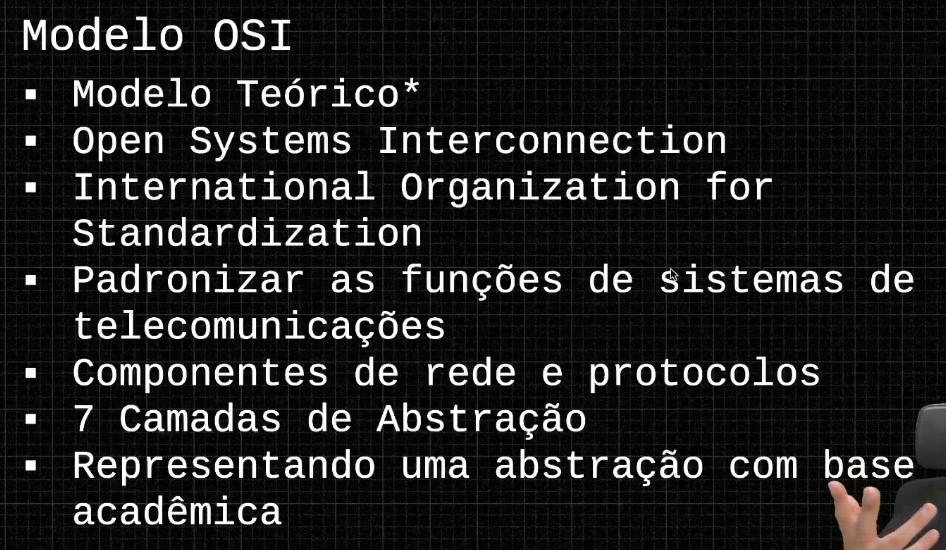
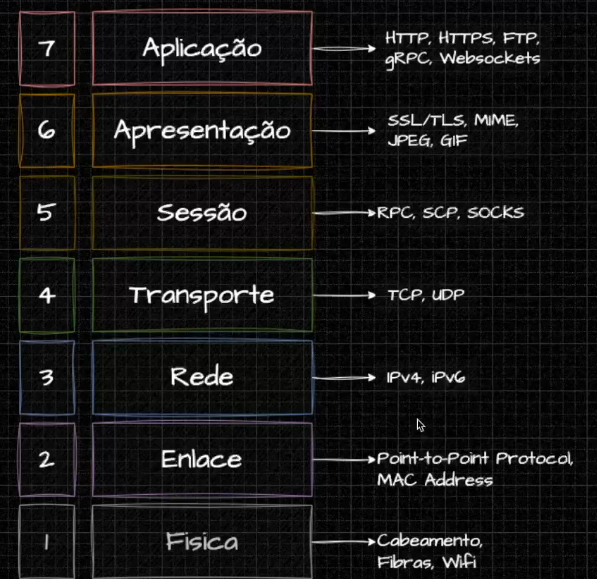
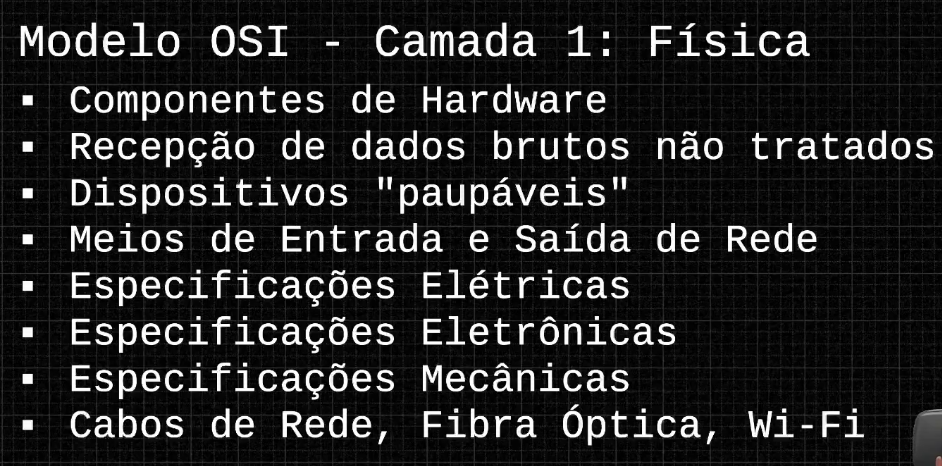
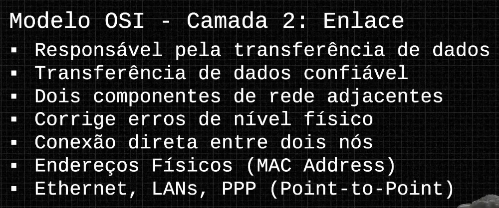
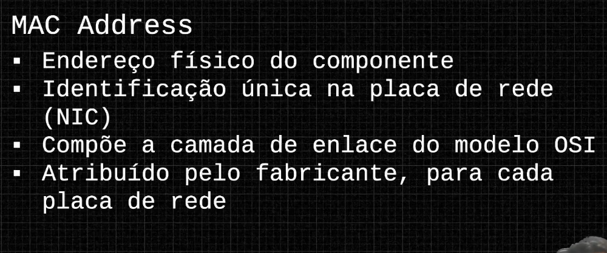
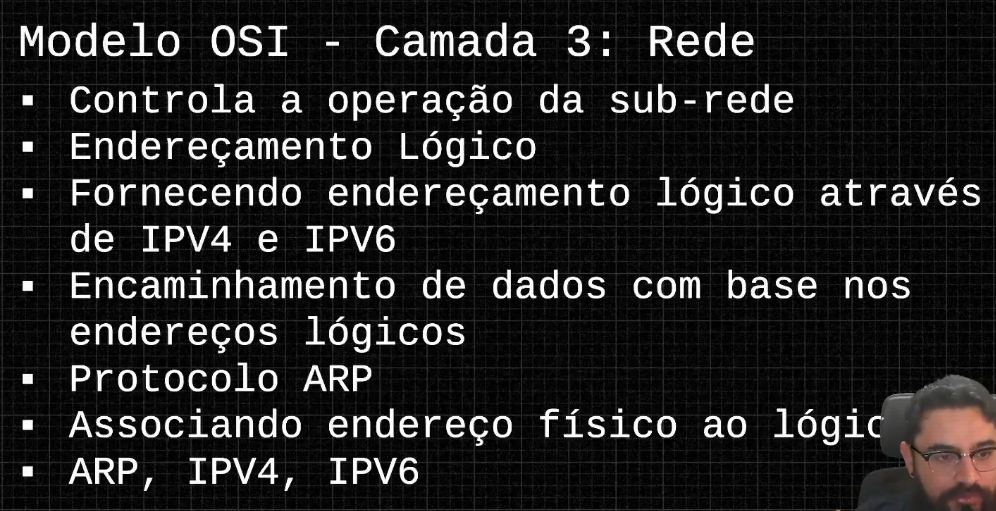

# Modelo OSI

#### OSI: Open Systems Interconnection

É um modelo acadêmico/teórico, construído na década de 80

É composto por 7 camadas de abstração

Serve para fazer troubleshooting em camadas de rede

Objetivo da camda OSI é explicar como as 7 seções funcionam

MAC Addres é o endereço físico da placa de rede, atribuídos ao fabricante, inclusive

MAC Addres trabalha ao lado do protocolo IP

IP é dinâmico e são endereços lógicos de comunicação entre componentes de rede

Protocolo ARP: usa abordagem de broadcast → permite traduzir IPs lógicos para endereços físicos. 

Transferência entre dados entre sistemas finais. O mais próximo do desenvolvedor

Gerência camadas de conexão

