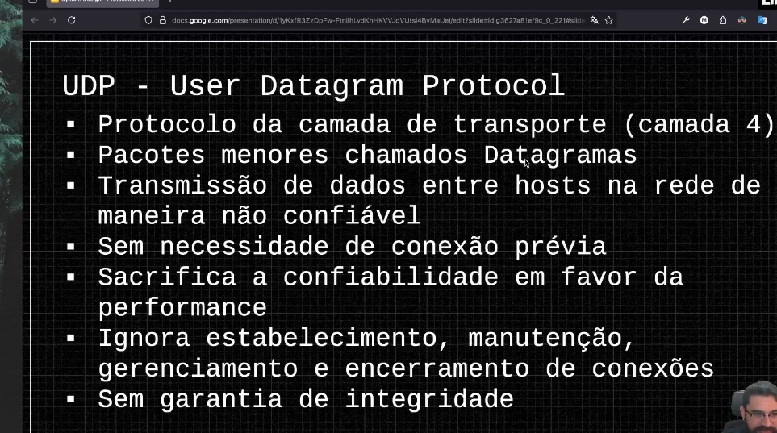
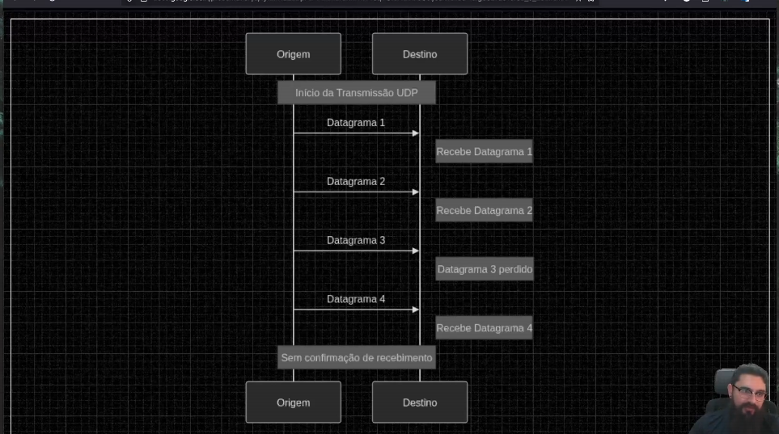
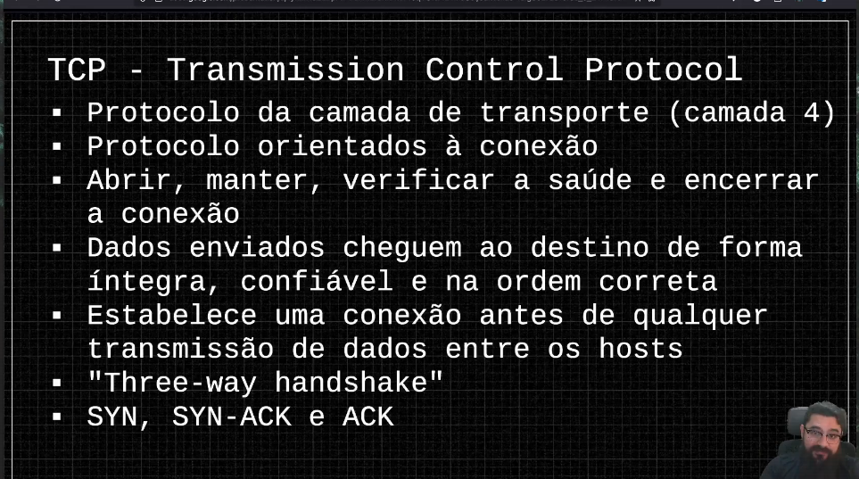
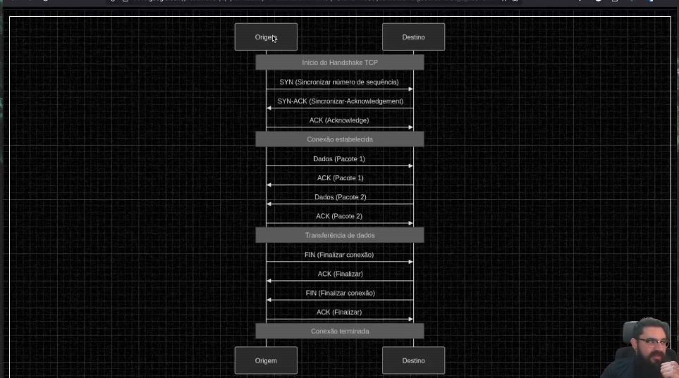
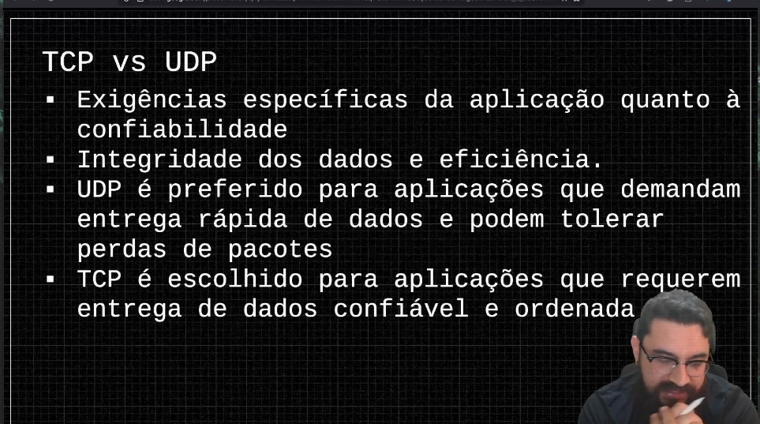

# Protocolo TCP e UDP

UDP nao necessariamente é entregue

É simples, mas não é confiável

Geralmente usado em streaming

É menos performático que o UDP, mas é muito mais confiável. Tem um mecanismo que tem confirmação da entrega dos pacotes

Tudo que é enviado e recebido exige confirmação no TCP.

O ciclo do desenho acima acontece toda vez que uma conexão é aberta entre duas aplicações. No entanto, o handshake não necessariamente vai abrir toda vez. Geralmente as aplicações abrem um pool de conexão e reutiliza ela sempre que for sair para outra aplicação.

A escolha entre estes dois protocolos, vai depender da confiabilidade que precisamos ter na aplicação