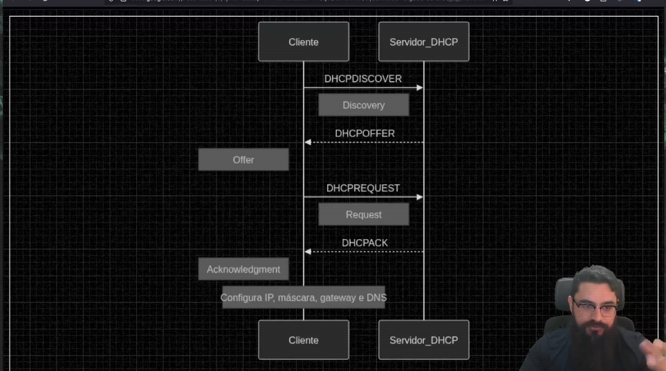

# Protocolo DHCP (dynamic host configuration protocol)

Ele é responsável por fazer alocação de IPs de forma dinâmica. Por exemplo, quando me conecto com meu celular numa rede wifi, o mac address do meu celular é dinamicamente configurado no roteador. O mesmo acontece em redes públicas, como wifi de shoppings, cafetirias ,etc

DORA ->
Discovery: É quando o dispositivo busca um servidor DHCP para se conectar
Offer: O servidor DHCP oferece um número de IP ao dispositivo para que ele se conecte
Request: O dispositivo envia ao servidor DHCP qual o número de IP ele aceitou
Acknowledgment: É a configuração entre os dispositivos entre IP e Mac Address

