# Protocolos HTTP/1, HTTP/2 e HTTP/3

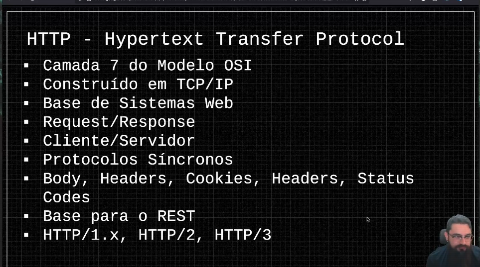

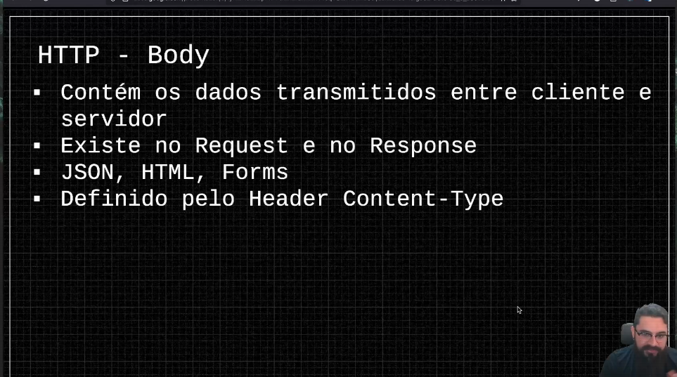

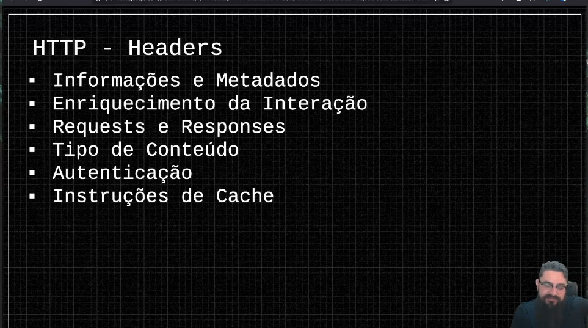

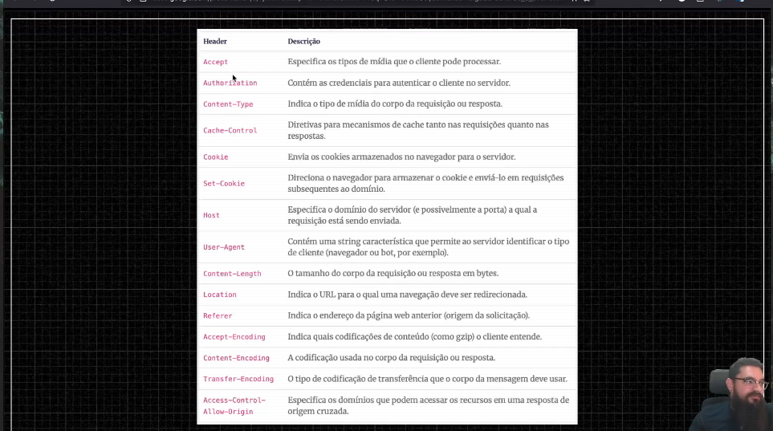

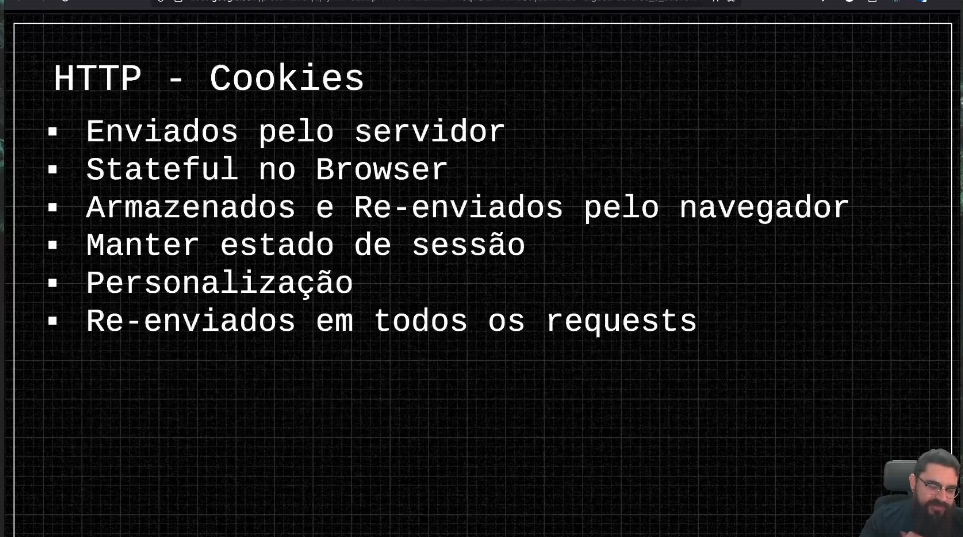

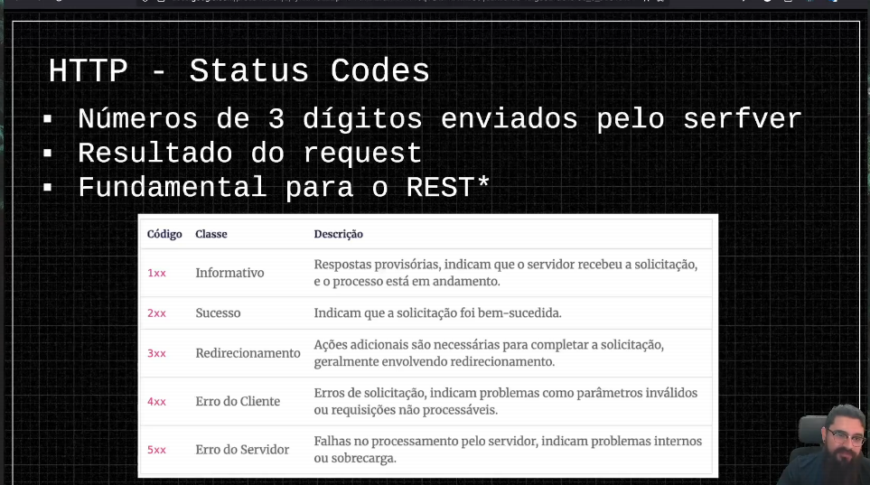

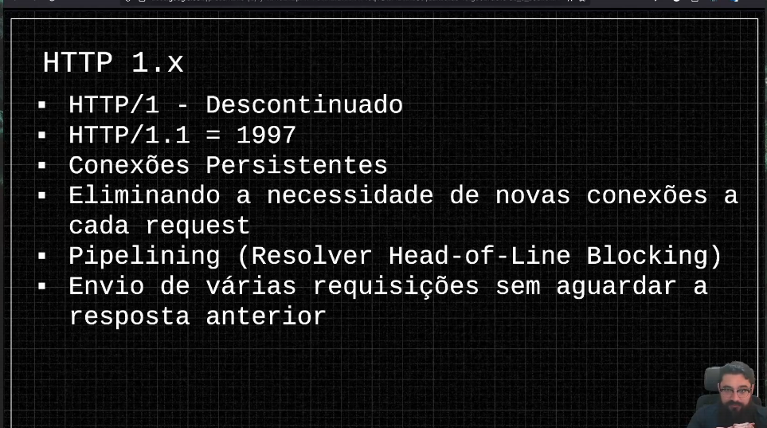

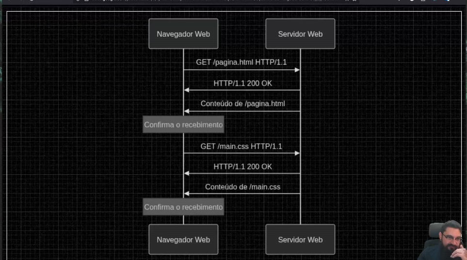

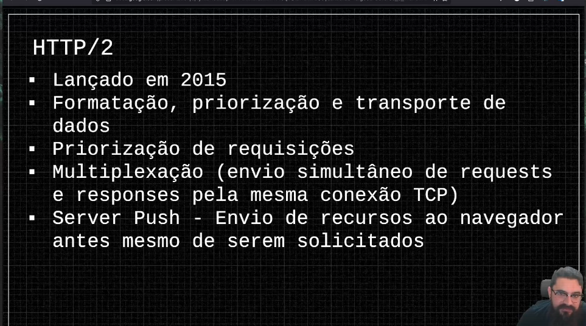

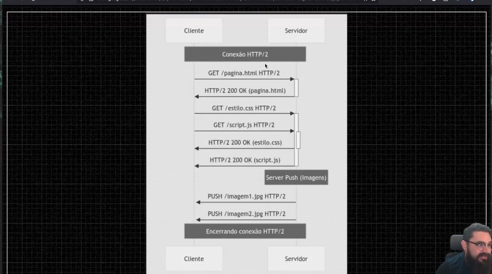

| Protocolo | Handshake por requisição | Requisições paralelas |
|-----------|--------------------------|----------------------|
| HTTP/1.0 | Sim | Não |
| HTTP/1.1 | Não (keep alive) | Não (serial) - a requisição vai e volta, para que a próxima consiga ir, mesmo que a conexão continue aberta |
| HTTP/2 | Não | Sim (multiplexing) - permite múltiplas requisições paralelas |

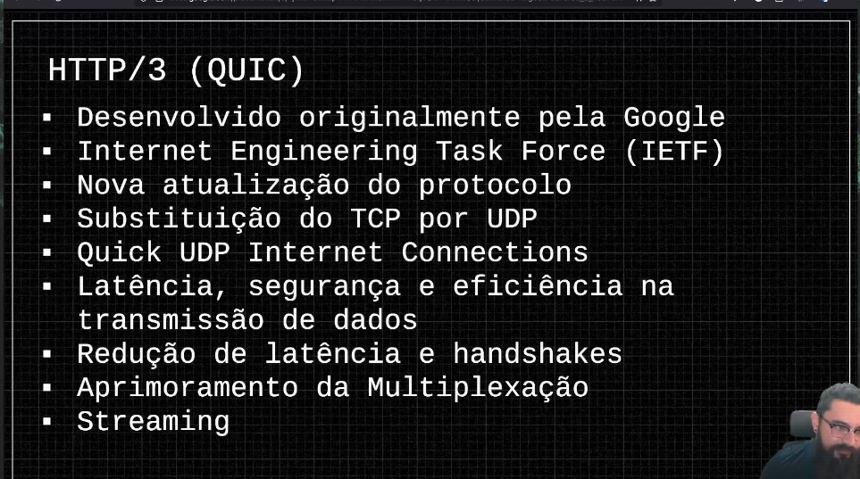

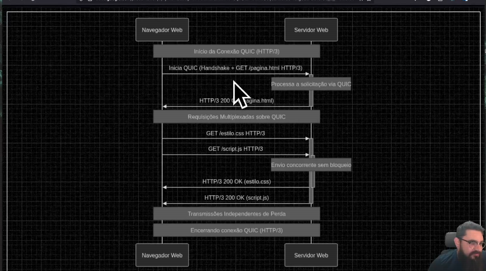

