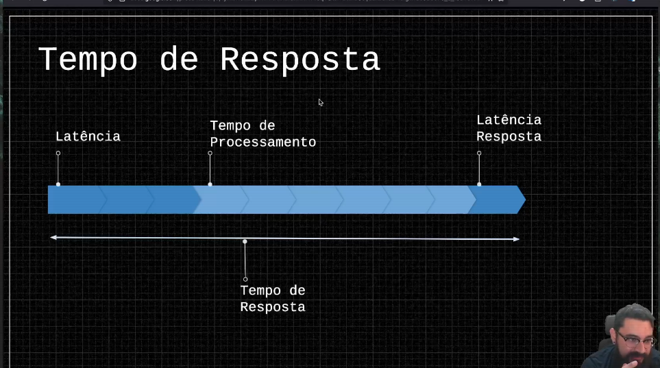

# Tempo de Resposta

Diferença entre latência e tempo de resposta?

Tempo de resposta é a soma de diversos fatores

Latência é o tempo que levamos para chegar até o servidor

Tempo de processamento é o tempo que o servidor demora para fazer o que estou pedindo a ele

Latência (parte de rede)

Tempo de processamento (parte do servidor)