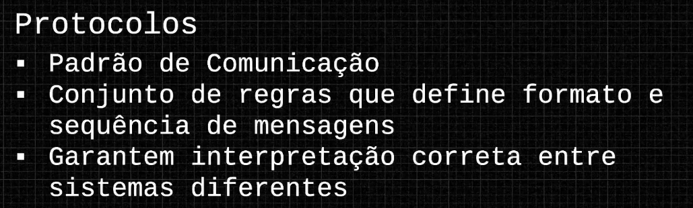

# Módulo 1 - Fundamentos e Protocolos de Rede e Pr

# Protocolos

Um protocolo na sua essência é um conjunto de regras/convenções que define como dois o mais sistemas se comunicam entre si. Funciona como linguagem de base compartilhada para que sistemas consigam se comunicar por meio de uma rede.

Define como mensagens serão as comunicações entre sistemas, estabelecendo uma linguagem comum de comunicação.

