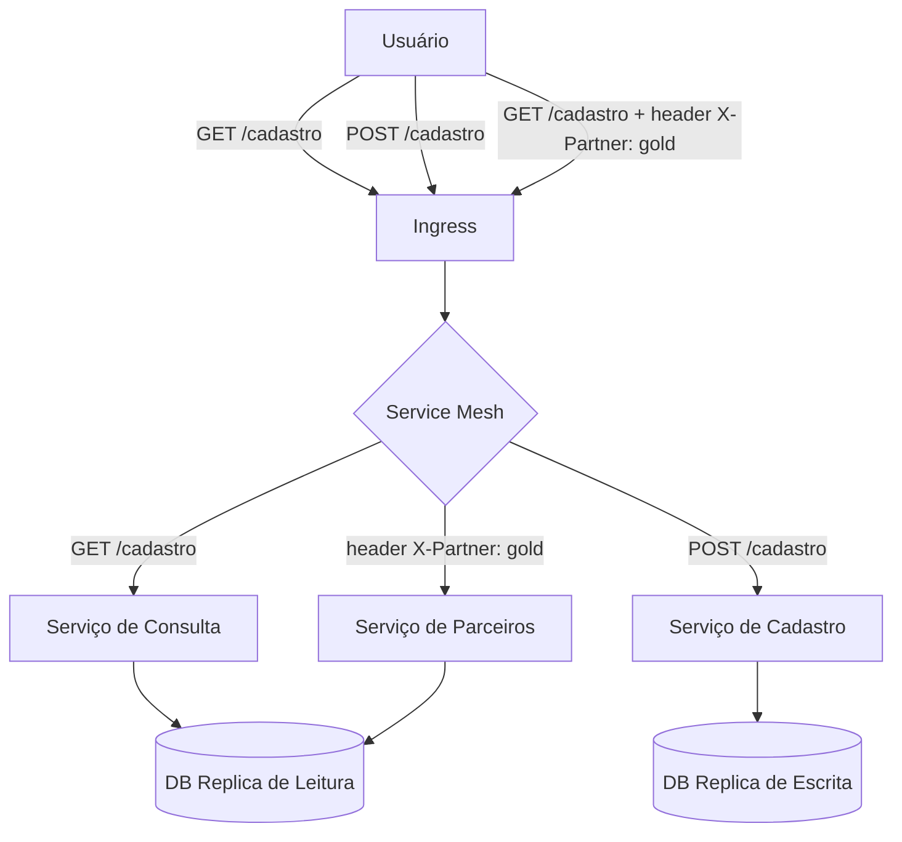
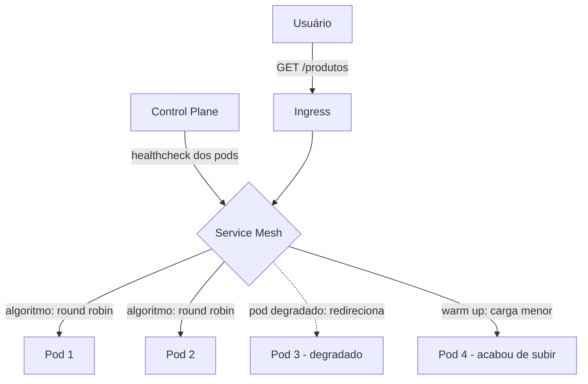
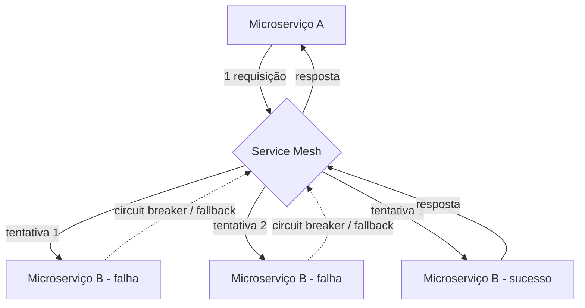

# Service Mesh

Service Mesh é um pattern de rede, onde de forma superficial, nós conseguimos tratar comunicações de rede como software.

Esse pattern é bem aplicado em uma arquitetura de microsserviços e poderia ter diversos mecanismos como:

- Mapeamento de pontos de contato
- Governança
- Monitoramento mais granular
- Interceptar e adicionar comportamentos de rede entre requisições de microsserviços

Um exemplo seria, imagine que o microsserviço A, fala com o microsserviço B via HTTP e o microsserviço B fala com o microsservço C via TCP.

O service mesh aplicado nessa arquitetura consegue interceptar todas essas comunicações e aplicar comportamentos nelas.

---

## Features de Service Mesh

A capacidade do service mesh ter features, vem da capacidade que ele tem de interceptação de comunicações de rede.

O service mesh ele tem características similares a load balancers e API gateways, no entanto, ele trata isso de forma interna e essa tecnologia e pattern estará composta dentro de um cluster ou um conjunto de cluster, seja ele EKS ou ECS, por exemplo.

Algumas das features são:

1. Interceptação de rede
2. Roteamento avançado
3. Modificação dos requests
4. Retries na camada de comunicação
5. Control e de recursos: circuit breakers, connection pool, keep alive, rate limit, health cehck
6. Segurança: criptografia (mTLS), autenticação e autorização
7. Metrificação

### Roteamento avançado

O uso de roteamento avançado dentro de um service mesh permite que o usuário através de um ingress, converse com determinado endpoint da aplicaçaõ e dependendo do conteúdo enviado na requisição, o service mesh consegue interceptar e tomar determinadas ações.

Imagine o usuário chamando o endpoint /cadastro em um cluster EKS. Quando o usuário enviar GET /cadastro o service mesh pode direcionar para o serviço de consulta de dados cadastrais, que conversa com uma réplica somente de leitura do banco de dados. Quando o usuário enviar POST /cadastro o service mesh pode direcionar para o serviço de cadastro do usuário, que conversa com a réplica de escrita do banco de dados. Se o usuário enviar GET /cadastro com um header específico, o service mesh pode entender este header e direcionar para outro microsserviço.

O service mesh intercepta cada requisição vinda do ingress e, com base no método HTTP ou no conteúdo dos headers, roteia para o microsserviço e a réplica de banco corretos.

---

### Balanceamento de carga

Via service mesh nós também conseguimos fazer o balanceamento de carga a nível da aplicação, sem precisar de um componente intermediário como um load balancer, no entanto, isso não elimina a possibilidade de trabalhar com os dois juntos.

A diferença de um load balancer é que ele trabalha numa camada externa ao servidor. O load balancer ele vai direcionar a carga a nível do servidor, enquanto o balanceamento de carga do service mesh vai trabalhar de forma com que ele escale os pods da aplicação, ele pode aplicar algorítmos diferentes de balanceamento, pode fazer redirecionamento direto caso algum pod esteja degradado ou trabalhar com warm up, direcionando uma carga menor para um pod que acabou de subir, além de subir novos pods.

Todas essas capacidades são possíveis devido ao Control Plane. O Controle Plane é um componente que recebe qual a saúde das réplicas de um determinado pool de pods, como um healthcheck.

O service mesh distribui a carga entre os pods da aplicação baseado na saúde informada pelo Control Plane, redirecionando tráfego de pods degradados, aplicando warm up em pods recém-subidos e escalando novos pods conforme a demanda.

---

### Observabilidade Desacoplada

Como conseguimos interceptar chamadas de rede com o service mesh, também é possível expormos métricas que apoiam na observabilidade da nossa aplicação. Por exemplo, posso expor métricas de quantas chamadas HTTP aconteceram para determinado microsserviço, qual a latência, etc.

---

### Segurança, Autenticação e Autorização

O service mesh dispõe de um Data Plane e um Controle Plane, que permitirá controlar acessos de microsserviços a outros microsserviços diretamente na camdada de rede, portanto, conseguimos segregar que o microsserviço A não acesse o micrisserviço B, diretamente na camada de rede. Isso é bastante usual em cenários de multi tenant, onde temos aplicações diversas em uma mesma malha de serviços e que não podem se comunicar entre si

---

### Criptografia mTLS

O service mesh também nos dá a possibilidade de trabalhar com certificados emitidos pelo próprio service mesh de forma mútua entre a comunicação de duas aplicações, sem que a aplicação sequer saiba disso, possibilitando comunicação criptografada em dia zero.

---

### Resiliência na Camada de Comunicação

Toda parte de resiliência também pode ser aplicada a nível do service mesh, por exemplo:

- Retry
- Circuit Breaker
- Fallback
- Connection pool

Tudo isso acontece a nível de interceptação de rede, sem que a minha aplicação saiba que isso está acontecendo. Por exemplo, imagine que o microsserviço A faça uma requisição para o microsserviço B. No service mesh, ele tenta 1x e a comunicação falha, ele tenta 2x e a comunicação falha, ele tenta 3x e a comunicação responde e então a resposta do microsserviço B chega para o microsserviço A. Nessa situação, para a camada da aplicação foi feita uma requisição apenas, no entanto, o service mesh fez 3 tentativa até conseguir fazer a comunicaçãode fato.

Aplicando retry a nível de rede, o service mesh tenta 3x chamar o microsserviço B até obter sucesso, mas o microsserviço A enxerga apenas 1 requisição. Circuit breakers, fallbacks e connection pools também são aplicados nessa camada de interceptação, sem que a aplicação saiba.

---

## Control Plane e Data Plane

Independente da implementação do service mesh, ele é composto por este dois componentes, o control plane e o data plane. Ambos trabalham em conjunto para que o service mesh funcione adequadamente.

### Control Plane

O control plane ele é onde todas as especificações de regras do service mesh estará. É basicamente como se fosse o plano de vôo do service mesh, armazenando o que, como e quando as coisas acontecerão.

Essas regras serão consultadas pelo data plane que as aplicará.

### Data Plane

O Data Plane é o braço do Control Plane. É ele quem aplica de fato as regras, as interceptações que foram definidas no Control Plane. Essas ações elas podem ser direcionadas ao Data Plane pelo Control Plane ou podem ser consultadas no Control Plane pelo Data Plane.

---

## Modelos de Service Mesh

### Client / Server

O modelo client / server de implementar o service mesh é por meio de um SDK. É um modelo que trabalha conjuntamente da aplicação, onde você utiliza uma biblioteca / SDK na própria aplicação, que será o Data Plane e que se comunicará com o Control Plane para aplicar as regras dispostas no Control Plane.

Não é um modelo bom, de acordo com o mercado, pois ele disvirtua a abstração da aplicação, pois eles ficam dependentes um do outro. Se a aplicação não conseguir se comunicar com o Control Plane, ela nem sobe, por exemplo.

### Proxy e Sidecars

Este modelo de aplicação do service mesh ele trabalha com um pequeno container rodando ao lado do container da minha aplicação, a nível do pod. Ele é o responsável por interceptar as comunicações de rede, se comunicar com o control plane e aplicar as políticas de rede que estão dispostas no control plane.

Ele é o modelo mais comum utilizado em service mesh, é computacionalmente barato para workloads pequenos e consegue aplicar todas as características que vimos até aqui.

### Sidecarless / Proxyless

Esse modelo vis trabalhar diretamente no Kernel e menos próxima a aplicação, sem a necessidade de componentes intermediários. Então a partir de um data plane que funcione no kernel, ele se comunica com o control plane para aplicar as políticas de comunicação de rede.

---

### eBPF (extended berkeley packet filter)

Quando uma comunicação de rede vai acontecer, diversas ações são feitas no kernel do sistem operacional, embora isso seja altamente abstraído para a aplicação.

O eBPF trabalha justamente nesta camada, no Kernel. Então quando a comunicação de rede está acontecendo e os comandos no Kernel estão sendo executados, a cada comando existe uma verificação se existe alguma injeção de código a ser feita nas syscalls. Isso é extremamente performático, pois acontece na camada mais baixo nível possível.

Por exemplo, se eu quiser interceptar a comunicação de rede no Kernel e criar uma IP deny list, isso é possível, usando o eBPF.

### zTunnel (Ambient Mode) - Zero Trust Tunnel

O zTunnel trabalha no layer 4 da camada OSI (layer de rede) e atua a nível do nó do cluster. Cada nó tem o zTunnel trabalhando e ele faz as interceptações das comunicações de rede, aplicando as políticas do control plane.

