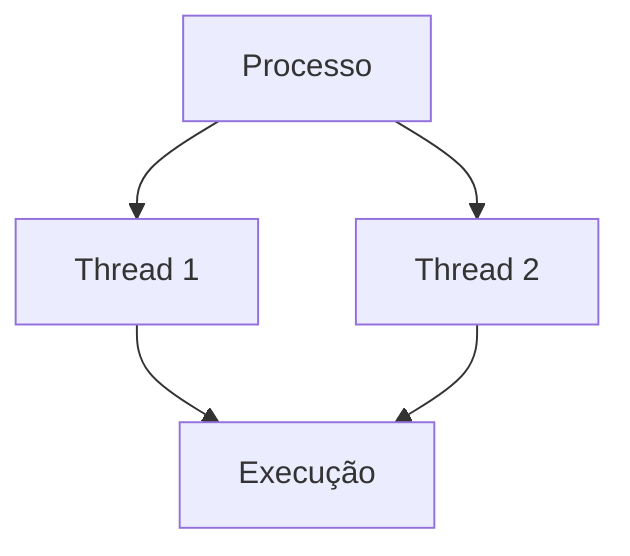
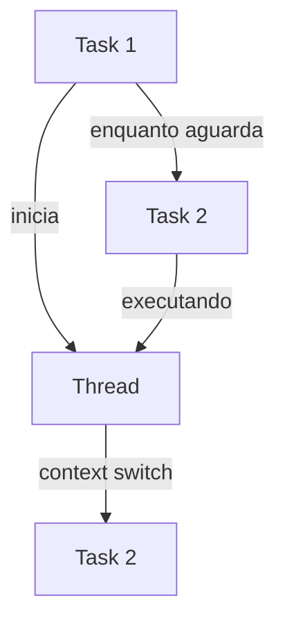
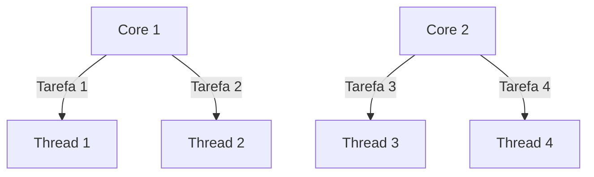
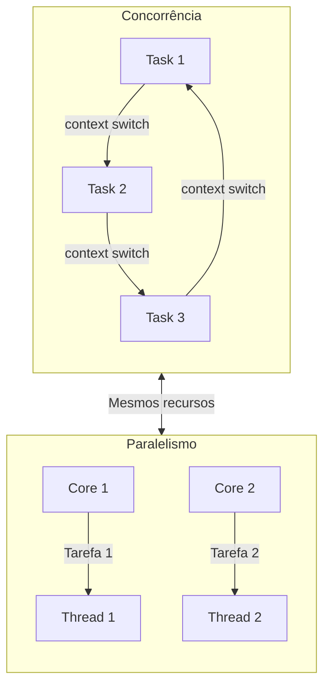

# Princípios de Concorrência e Paralelismo

Concorrência e paralelismo são pilares de perfomrnace moderna. É a capacidade de executar várias coisas e fazer várias coisas ao mesmo tempo e pode trazer impactos significantes em throuput, latência e eficiência de um software.

Abaixo vamos dividir alguns conceitos básicos, para dar uma base sólida em cima deste conceito.

## Processo

Processo ele representa uma instância de um software. É o que o sistema operacional entende como a execução de uma instância de uma app, com memória, thread e contexto apartado de outros processos. É uma abstração de isolamento

## Thread

Thread é a menor unidade de medida que representa a execução de algo. Ela compartilha da mesma memória que outras threads que estão dentro de um mesmo processo, dando eficiência e alternância entre tarefas, possibilitando também multiprocessadores executarem tarefas simultâneas.

## Multithreading

Multithreading é a capacidade de execução de várias threads ao mesmo tempo. Possibilitado por uma CPU com vários cores, a fim de reaproveitar tempo ocioso entre execução de tarefas.

## Exemplo Mermaid

---

## Concorrência

Concorrência é a capacidade de lidar  com várias tarefas ao mesmo tempo, com os mesmos recursos. Dentro de um núcleo do processador (ou seja, mesmo recurso) é possível fazer o que chamamos de context switching. É basicamente a capacidade de alterar entre a tarefa 1 e a tarefa 2, de forme organizada.

A concorrência ela da a impressão de estar executando as tarefas de forma simultânea, mas não está. Ela apenas se organiza para executar várias coisas ao mesmo tempo.

Usando como exemplo o preparo de uma massa de macarrão. Você, como cozinheiro, coloca o macarrão para cozinhar (tarefa 1), enquanto o macarrão cozinha, você está temperando a carne para fazer o molho (tarefa 2). Depois que o macarrão terminou de cozinhar, você escorre a água do macarrão (tarefa 1) e depois introduz o molho (tarefa 2). Alternamos entre duas tarefas para chegar num objetivo final, que é comer o macarrão.

---

## Paralelismo

Paralelismo é de fato a capacidade de fazer várias coisas ao mesmo tempo. Dentro de um CPU, que possui vários núcleos/cores, é possível que cada núcleo/core execute uma tarefa diferente ao mesmo tempo.

Usando o exemplo acima do macarrão, é como se houvessem duas pessoas para este preparo. Uma está fervendo o macarrão e outra está preparando o molho, ao mesmo tempo, sem ter a alternância entre as  tarefas.

Para que o paralelismo aconteça, é necessário que haja mais de um núcleo/core.

### Paralelismo Interno

Paralelismo interno é aquele que codificamos em nossa aplicação, dividindo tarefas entre núcleos diferentes de uma mesma CPU e até aplicando concorrência entre eles. O paralelismo interno consiste em executar dentro do mesmo container.

### Paralelismo Externo

Paralelismo externo é aquele que é aplicado em arquiteturas distribuídas, onde eu executo várias coisas ao mesmo tempo, mas dependo de um intermediator. O load balancer ele é capaz de fazer um paralelismo externo, ele pega várias requisições e distribui entre vária réplicas. Um broker de mensageria recebe várias mensagens e distribui para vários consumidores, que fazem coisas paralelas, em diferentes hardwares, processos, CPUs e memórias.

---

## Concorrência vs Paralelismo

Se observarmos ambos os conceitos, eles se parecem muito, mas existem diferenças entre eles.

Como vimos, a concorrência é a capacidade de se organizar entre múltiplas tarefas. Já o paralelismo é a capacidade de executar várias tarefas ao mesmo tempo.

A concorrência não requer múltiplos processadores (hardwares), um úniclo núcleo de CPU consegue fazer concorrência.

O paralelismo ele requer múltimos processadores (hardwares), permitindo com que uma tarefa seja executada em um núcleo diferente ao mesmo tempo.

O paralelismo ele pode também trabalhar com concorrência, mas o contrário não é verdadeiro, ou seja, a concorrência nunca poderá trabalhar com paralelismo.

## Concorrência vs Paralelismo (Visual)

---

## Problemas Clássicos

Trabalhar com paralelismo requer alguns cuidados, pois começamos a deixar um pouco mais complexo o modo em que lidamos com as tarefas. Como nem tudo são flores, existem alguns problemas cássicos que teremos que lidar quando trabalhamos com paralelismo.

### Deadlocks e Starvation

Dois problemas bem clássicos são Deadlocks e Starvation. 

Um deadlock acontece quando duas threads estão compartilhando um mesmo recurso e ambas ficam esperando entre si a liberação deste recurso, para que ela termine sua execução, mas essa espera nunca termina, travando o processo.

Imagine que você e sua esposa estejam na cozinha e vocês querem fritar um bife. Para fritar um bife vocês dependem de uma frigideira e uma espátula. Você está com a frigideira e sua esposa com a espátula. Dois recursos necessários para finalizar a tarefa de  fritar o bife. Você não libera a frigideira, por que quer fritar o bife e sua esposa não libera a espátula por que também quer fritar o bife e vocês ficam esperando por isso eternamente. Isso é um deadlock.

Um starvation é quando uma thread não tem prioridade sob outras e acaba sofrendo de inanição. Sofrer de inanição seria como não conseguir prioridades ou recursos suficientes pra completar a sua tarefa e ela acaba morrendo.

Imagine que você esteja em um jantar com seus amigos, com mesa posta, arroz, feijão e uma bela leitoa. Alguns dos seus amigos são esfomeados e pegam toda a comida, enquanto outros amigos são mais comedidos e acabam ficando sem a comida. Isso é um starvation.

### Race Condition

O race condition é um problema que acontece quando duas threads diferentes alteram um mesmo recurso e este recurso fica com um estado inconsistente após a execução.

Race condition pode acontecer em paralelismo interno e externo.

Imagine que seu programa tenha um laço de repetição de 10 iterações para escrever o incremento de +1 em uma única variável (recurso). A thread A, lê a variável inicialmente em 0, a thread B, também. Na execução do laço, como não conseguimos controlar o tempo em que cada thread escreverá o incremento, pode acontecer da thread A ter em memória que a variável é 1 e somar para 2, mas a thread B está adiantada e escreve em cima de 2 o valor 5. No fim, este contador está inconsistente.  Isso é um exemplo de um race condition em um paralelismo interno.

Agora imagine um sistema distribuído, onde eventos de pagamentos são enviados para uma fila e cada evento é processado por um pool de workers que leem esta fila. Cada worker pode processar o evento em um determinado tempo. Foi enviado de forma ordenad para a fila, primeiro o evento de pagamento pendente e após o evento de pagamento finalizado. O pool de worker recebe os dois eventos. O evento de pagamento finalizado demora 1 segundo para ser processado e o evento de pagamento pendente demora 2 segundos (após o processamento do pagamento finalizado). Ao final da execução, a persistência no banco mostrará que o pagamento está pendente, mesmo que o evento de pagamento finalizado tenha sido processado. Isso é um exemplo de race condition em um paralelismo externo.

Com estes exemplos, podemos observar também o conceito de Last Write Wins, que diz que sempre a última escrita prevalecerá. Uma forma de evitar este tipo de inconsistência de race condition, é usar timestamp ao nosso favor, processando sempre por último aquele que tiver o maior timestamp.

---

## Mutex - Mutual Exclusion (paralelismo interno)

O mutex é uma das formas que podemos trabalhar para evitar race conditions. O conceito por traz do mutex é a capacidade de fazer lock do recurso que está sendo compartilhado entre as threads e fazendo unlock dele ao final da execução.

Vamos usar  como exemplo o contador que usamos acima, imagine que a thread A quando for incrementar +1, faça o lock da variável e só a libere quando finalizar o incremento. Assim, quando a thread B capturar a variável para incrementar, ela terá o estado consistente da variável. Caso o recurso ainda esteja em lock, a thread ficará aguardando e verificando seu estado (lock ou unlock) até que ela consiga processar.

---

## Mutex Distribuído (paralelismo externo)

O mutex distribuído servirá para resolver problemas de race conditions em aplicações distribuídas. Para poder aplicá-lo, vamos precisar de um mediador, que trabalhará com o lock e unlock do recurso, que será um ator externo, como por exemplo o redis.

Fazendo uma alusão a um cenário real, imagine um sistema que controla o pouso e decolagem de aviões. Enquanto há um avião pousando, não podemos liberar a pista para que outro decole ou pouse. Então quando um avião for utilizar a pista, precisamos registrar o lock disso em um banco de dados, para que todas as réplicas do sistema dos operadores de vôo leiam, antes de liberar a pista para outro avisão. Assim que o avião termina de usar a pista, o lock pode ser removido deste banco de dados, para que o operador saiba e libere a pista para outro avião.

O banco de dados neste caso pode ser um redis, um memchache, zookeeper.

---

## Spinlocks

O spinlock é outro algoritmo para lock de recursos, no entanto, ele não coloca a thread em sleep para depois avaliar se o recurso foi o não liberado. O nome spin é por que ele fica constantemente verificando se o recurso foi liberado para então usá-lo. É recomendado para operações que utilizam o recurso por um baixíssimo tempo e visam dar maior vazão na execução de tarefas.

---

## Semáforos e Worker Pools

O conceito de semáforo é utilizado quando queremos trabalhar com worker pools. Um wooker pools representa vários worker que processarão tarefas. Dito isso, eu quero poder controlar quantas tarefas serão executadas por vez dentro de um pool de workers, que é limitado. Então se eu tenho 10 workers que processam 1 tarefa por vez, eu posso liberar 10 tarefas para serem executadas. Quem controla quantas tarefas serão liberadas aos workers é o semáforo.

Para deixar mais lúdico, imagine o processamento de pedidos. Estes pedidos são processados em paralelo por um pool de 100 workers. O semáforo liberará 1000 pedidos par serem processados, por que cada worker pode processar até 10 pedidos em paralelo. Se chegam 2000 pedidos, o semáforo mandará somente 1000 para serem processados. A medida em que os pedidos terminam o processamento, o semáforo libera novos pedidos para serem processados. Então se 200 pedidos terminaram, novos 200 entram para serem processados.

