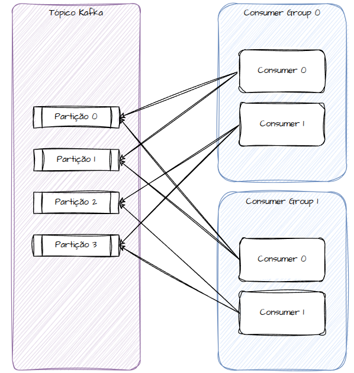

# Comunicações Assíncronas

Comunicações ou arquiteturas assíncronas elas existem para apoiar arquiteturas já complexas e não para tornar uma arquitetura simples mais complexa. Ela existe para reduzir dependências temporais entre serviços, resolver acoplamento forte, latência e dispnibilidade.

Uma arquitetura assíncrona ela é desacoplada by default, traz mecanismos de resiliência embutidos como DLQ e retry, permitindo trabalharmos com eventos e mensagens (existe uma diferença conceitual entre os dois tipos).

## Mensagens e Eventos

### Mensagens

Uma mensagem trafegada entre dois sistemas, funciona através de um produtor, um intermediário (a fila) e um consumidor. A arquitetura de mensageria presume sempre 1 para 1, ou seja, para um produtor eu terei um único consumidor daquela mensagem.

Uma mensagem ela caracteriza um comando, como algo imperativo e que também representa continuidade de um processo.

As filas elas podem ser ordenadas ou não, a depender de como a configuração for feita.

### Eventos

Quando estamos falando de eventos, ele funciona de forma a notificar algo, como se algo tivesse terminado e o consumidor gostaria de consumir este evento para fazer algo.

Neste caso, o produtor não conhece os consumidores e podem haver N consumidores de um tópico de eventos.

Uma arquitetura orientada a eventos tem uma natureza mais desacoplada, dado que o produtor não quer e nem precisa saber quem são os consumidores e nem o que eles farão com este evento. Os consumidores são interessados neste evento por algum motivo.

### Command e Event Patterns

De acordo com a ciência da computação, eventos são mensagens em um nível. Nós temos três tipos de eventos:

1. Documento: um documento representa uma entidade anêmica. Algo enviado como mensagem/evento contendo dados que não farão algo. O cadastro de um cliente por exemplo.
2. Mensagem: como vimos, a mensagem é algo imperativo e ativo. Tem a característica de dar continuidade em um processo, por exemplo: faça o envio de e-mails, ou, cadastre este cliente.
3. Evento: como vimos, o evento é algo reativo e tem característica de notificar que algo ocorreu. Por exemplo: uma venda foi feita, ou, o cadastro do cliente foi efetivado.

## Conceitos de Mensageria

### FIFO (First In, First Out)

Filas FIFO tem em sua essência o sentido literal de uma fila. O primeiro a entrar é o primeiro a sair. Ela tem essa característica, pois cada mensagem enfileirada, segue uma ordem, que é: a primeira mensagem que entrou, será a primeira a sair. É adequada para situações ou sistemas que demandam ordenação de algo.

Existem flexibilidades em cima deste tipo de fila, eu posso ter duas características, sendo que uma eu literalmente travo toda a fila até a primeira mensagem que entrou sair e outra que posso trabalhar de forma mais flexível, liberando a fila mesmo sem ter processado com sucesso uma mensagem, tratando ela posteriormente.

### LIFO (Last In, First Out)

O LIFO é o contrário do FIFO. Ele indica que o último elemento que entrou na fila, será o primeiro elemento a ser  consumido. Ele trabalha numa estrutura de pilhas (stack).

Imagine uma pilha de pratos para lavar. O último prato colocado, será o primeiro a ser lavado.

Não é comumente utilizado, no entanto, é uma estrutura de dados existente para mensageria, bastante utilizada quando você precisa recompor algo. Pensando no sistema operacional, o CTRL + Z trabalha com pilhas, ou seja, quando você pressiona este atalho, ele remove o último elemento adicionado na pilha :)

### Fanout

O fanout ele é utilizado quando uma mesma mensagem precisa ser enviada para um grupo grande de consumidores. É bastante parecido com o conceito de eventos. É uma estratégia utilizada para replicação de dados e não notificação de eventos.

### DLQ (Dead Letter Queue)

Uma DLQ é um mecanismo de fallback para mensagens. Ela funciona como um mecanismo que armazena mensagens que não puderam ser consumidas ou por que tentamos processar essa mensagem várias vezes e não deu certo, por qualquer que seja o motivo.

Isso existe para não impactar outras mensagens que estejam na fila e precisam ser processadas. Por exemplo, imagine que temos uma fila de mensagens para cadastrar um cliente. Se determinada mensagem chega na fila faltando um dado obrigatório, o consumidor não conseguirá processá-la corretamente. O ideal é que esta mensagem seja levada para a DLQ, para que posteriormente a gente analise e entenda o motivo de não ter sido processada.

Existem meios de reprocessar as mensagens de um DLQ, fazendo um redrive.

Uma DLQ tem um limite, as mensagens que ficam lá, são configuradas para ficar por um determinado momento e podem ser excluídas de lá.

### Processamento em Batches

Processamentos em batches indicam o acumulo de algo que será processado em lote em um determinado momento. Ele é o motivador de comunicações assíncronas e tem a característica de serem agendados. Vou processar o relatório do último mês sempre no dia 05 de cada mês, por exemplo.

## Streaming de Dados

Streaming de dados indica uma arquitetura que faz envio de dados para N consumidores, que processarão estes dados para tomada de uma decisão NRT (near real time).

Alguns exemplos disso são:
1. Motores de fraudes: recebe eventos de compra de vários clientes e processam isso e conseguem indicar compras fraudulentas;
2. Recomendações da Netflix: recebe eventos de séries e filmes que você assiste e consegue muito próximo do tempo real te indicar uma nova série ou filme, baseado no que você assistiu.
3. Redes sociais: recebem eventos de stories que você viu, posts que curtiu e te recomendam coisas parecidas.

## Event Driven

Event Driven são arquitetura orientadas a eventos, que produzem eventos de um determinado domínio e distribui para outros N domínios, que precisam processar este evento.

É um padrão arquitetural que visa desacoplamento entre os domínios e arquitetura complexas que precisam processar um alto volume de dados muito próximo do tempo real.

Imagine um sistema de vendas. Quando o vendedor registra esta compra, que é do domínio de Vendas, ele distribui o evento para os domínios Fiscal (que vai emitir a nota), Pagamento (que vai faturar o pedido), Frete (que vai enviar o pedido).

## Protocolos de Mensageria

### Kafka, Streaming e Eventos

Kafka é uma plataforma de streaming, projetada intencionalmente para lidar com alto volume de dados, permitindo performance na produção e consumo de dados.

O Kafka é baseado em produção e consumo.

#### Producer

Responsável por publicar eventos em tópicos Kafka. Podem ou não especificar qual partição o evento será publicado. Caso não seja especificado, o próprio Kafka se encarregará de fazer essa distribuição.

Chave de partição é importante quando queremos garantir que um consumidor obtenha sempre os dados de um produtor, dando experiência de continuidade e ordem. Isso pode acarretar um problema que chamamos de Hot Partition, onde o produtor envia um volume muito grande de dados para um único consumidor.

Usar chave de partição pode ser importante quando eu preciso garantir ordenação no consumo dos eventos e não permitir que eventos sejam consumidos fora de ordem.

Replication Factory, o producer pode querer aguardar um ACK do broker de eventos. Ou seja, eu faço a produção e aguardo o broker sinalizar que recebeu o evento. Quanto maior o número de ACK, maior a confiabilidade da entrega do dado. Podemos não querer receber a confirmação de recebimento em determinados cenários, por exemplo: se eu quiser contar a quantidade de clicks em um botão em uma página, tudo bem se eu perder uma quantidade de eventos. Agora se eu estiver falando de eventos de transações bancárias, é necessário que eu receba todos os eventos, exigindo um número de ACK maior.

Outra forma de escrita em tópicos Kafka é o Batch Size. O Batch Size ele permite o acumulo de mensagens para posterior envio ao tópico, podemos parametrizar por exemplo o acumulo de 1000 mensagens para que então façamos a publicação no tópico.

Junto com o Batch Size podemos trabalhar também com o Linger Time. O Linger Time é o tempo parametrizado para envio das mensagens ao tópico sem que o Batch Size tenha chego no limite, bastante importante para não atrasarmos o envio de mensagens. Por exemplo, imagine um Batch Size de 1000, o Linger Time pode ser configurado para 1 minuto. Isso indica que, se em 1 minuto não tivermos chego em 1000 mensagens, elas serão enviadas na quantidade acumulada até o momento.

O Batch Size mantém mensagens em memória, portanto, há risco de perda de mensagens caso haja alguma intercorrência antes da publicação no tópico.

#### Consumer

Responsável por consumir eventos uma ou mais partições de tópicos Kafka. Consumidores não compartilham partições, são sempre 1 para 1 (1 partição para 1 consumer). Imagine um tópico Kafka com 04 partições. Se eu tenho dois consumidores, serão 02 partições para cada consumidor.

Eu posso ter consumer groups, que agruparão consumidores. Cada consumer group pode consumir todas as partições, mas o número de consumidores dentro do consumer group nunca pode exceder o número de partições. Por exemplo, se eu tenho um consumer group com 05 consumidores e um broker com 04 partições, um consumidor ficará sem consumir nada. Isso é um problema de escalabilidade horizontal em consumidores Kafkas.

Resumo: Consumers Groups podem consumir todas as partições. Consumers podem consumir apenas uma partição.

Consumer Groups são identificados nominalmente.

O Kafka possui um algoritmo de rebalanceamento. Sempre que um consumer entra ou sai, as mensagens param de ser lidas por um certo momento, até que o Kafka faça o rebalanceamento, conectando as partições para os consumidores.

Uma dúvida que fiquei durante a aula foi se existia um mecanismo de auto-scaling das partições e não existe. O número de partições pode crescer, mas exige uma ação manual. Adicionar uma nova partição ou um novo consumer exige que o Kafka faça o rebalance. Todo rebalance é perigoso e não só pela pausa da leitura, mas também por que cada Consumer, precisa fazer o commit da leitura da mensagem que está sendo processada (isso indica sinalizar ao tópico que a mensagem foi lida e que ela não precisa mais ser processada, podendo sair da fila). Caso no rebalance, a Partição 1 que antes era processada pelo Consumer 1, passa a ser processada pelo Consumer 2 sem que o Consumer 1 tenha feito o commit, corremos o risco de processar a mesma mensagem duas vezes (importância da idempotência).

Isso pode acontecer de diversas maneiras, não só adicionando uma nova partição. Pode ser que um consumer caia. Isso também exigirá um rebalance. Trabalhar com escalabilidade em Kafka pode ser uma dor grande.

#### Cluster e Broker

Um cluster de Kafka é composto por vários servidores, que são os Nós (nodes) que são denominados Brokers. Eles são os responsáveis por receberem as mensagens e distribuir aos consumidores. Os brokers possuem replicação entre si, configurados pelo Replication Factory, para que se caso algum broker caia, outro broker tenha a mensagem para distribuição aos consumidores.

#### Tópicos

Um tópico representa um domínio claro de recebimento de mensagens. O tópico é onde são agrupadas as partições e as partições é o que permite o paralelismo de mensagens dentro de um tópico. A nomenclatura de um tópico precisa ser clara e representar bem o domínio das mensagens que serão processadas, a fim de que consumidores saibam o que podem consumir daquele tópico.

#### Partições

Partições estão dentro de tópicos e é o que permite o paralelismo de consumo de eventos. Os eventos são publicados em todas as partições, o que é análogo ao balanceamento de carga.

#### Fator de Replicação

Dentro de um broker existe um tópico, que é composto por 1 ou mais partições. Para cada grupo de partições existe um líder, que será responsável pela replicação dos eventos em todos os demais brokers. Isso garante que o mesmo evento seja distribuído entre todos os servidores (brokers) e que caso um broker caia, o evento ainda seja processado. Isso é configurado no Replication Factory.

## MQTT

Message Queuing Telemetry Transport. Protocolo de mensageria que foi construído para ser leve. É bastante voltado para situações de IOT, comunicação entre dispositivos permitindo hardwares e gadgets em filas para ser consumido por clientes. Voltado para eficiência e dispositivos pequenos, que podemos construir com arduído, por exemplo.

Protocolo que trabalha no over TCP, ou seja precisa esbelecer conexão entre cliente e servidor, garantia de entrega de pacotes, em ordem, sem duplicidade e tudo que o protocolo TCP oferece.

### Default Subscription

Modelo de publicação e assinatura que indica que uma única mensagem será entregue para N consumidores, independente de quais sejam os consumidores (pode ser uma aplicação ou até mesmo um outro gadget) e as mensagens.

### Shared Subscription

O Shared Subscription serve para processamento de mensagens em larga escala. Neste cenário o broker de mensagem será assinado por um único gadget ou aplicação, que pode ter N réplicas. O Shared Subscription garante que as mensagens sejam particionadas e entregue uma por consumidor, sem que haja sobrecarga em um único.

## AMQP

Advanced Message Queuing Protocol. Ele é projeto para integrar aplicações complexas. Ele é mais robusto do que o protocolo MQTT, permitindo entrega de mensagens criptografadas, retentativas, mensagens duráveis. É este protocolo que suporta o RabbitMQ, por exemplo. Neste protocolo AMQP é utilizado o protocolo TCP.

Conseguimos fazer enfileiramento, flexibilidade de entradas, regras de roteamento específicas e tem gamas mais complexas de conceitos.

- Exchanges: serve como um direcionador. Ele recebe a mensagem, trata e envia para quem de direito. Ele antecede a fila em si. É a forma mais comum de uso do protocolo. Armazena configurações de roteamento das mensagens, baseado em metadados enviados ao exchange
- Brokers: É onde moram as filas
- Channels: 
- Queues: 
- Producers: são os produtores das mensagens
- Consumers: são os consumidores das mensagens
- Binding Keys: representa o nome de uma fila

Tipos de exchange:

### Direct Exchange

É o padrão, se não for especificado, essa é quem será utilizado. Ele representa uma conexão de peer to peer. O publicador da mensagem especificará o binding key, para que o exchange saiba para qual fila enviar a mensagem.

### Topic Exchange

Fornece uma gama maior de flexibilidade de roteamento. Conseguimos direcionar para filas específicas a depender do binding key configurado, fazendo uso de caracteres coringas (* ou #), por exemplo.

Se eu tenho 03 filas: (1) faturamento; (2) faturamento_prioritario; e (3) faturamento_datalake, eu posso configurar 03 binding keys: (1) faturamento.prioridade.default; (2) faturamento.prioridade.alta; e (3) faturamento.*

As mensagens podem ser entregues da seguinte forma:
1. Binding Key: faturamento.prioridade.default, sempre entregará na fila faturamento
2. Binding Key: faturamento.prioridade.alta, sempre entregará na fila faturamento_prioritario
3. Binding Key: faturamento.*, receberá todas as mensagens, seja ela o faturamento default ou prioritário

### Fanout Exchange

O Fanout exchange ele é o caso onde publicamos em um único exchange e sem regras de roteamento, ele é entregue para várias filas, sem binding keys específicas.