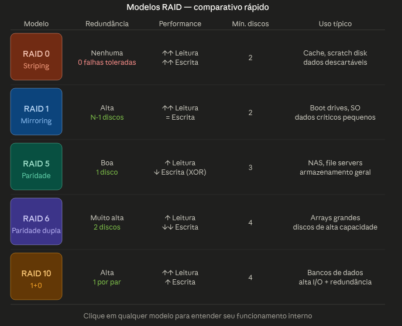

# RAID e Storage

## Storage

Permite armazenamento de dados. É armazenamento de dados por longo perído de tempo, de forma segura, com desempenho, latência e escalabilidade.

Permite escrita em HDD, SDD, Sistemas de Rede, NFS

---

## Troughput

Significa o quanto a minha aplicação trabalha com persistência de dados. Por exemplo, minha aplicação escreve 100 MB/s em um storage. Isso indica o troughput

## Bandwith

Significa o teto máximo que o storage suporta de escrita. Se eu tenho uma aplicação que escreve 100 MB/s, o meu bandhwith pode ser 1 GB/s. O que inidica que o máximo que o storage suportará de escrita por segundo é 1GB.

---

## Modelos de Storage

Assim como o modelo OSI, existe um modelo se classificação/arquiteturais de storage.

### DAS - Direct-Attached Storage

É basicamente um storage plugado direto no servidor. É ideal para situações em que precise de baixíssima latência, pois estar plugado no servidor faz com que a latência de escrita e leitura seja baixa e quase nula.

São storages plugados por cabos, USB.

Problemas: 

- É de difícil escalabilidade, geralmente se precisar escalar um DAS, você necessariamente precisará adicionar um novo storage físico.
- Não permite que vários clientes usem um mesmo DAS. Sempre haverá uma conexão 1:1, ou seja, um host para um DAS

### NAS - Network-Attached Storage

O NAS é a conexão com um storage através de uma rede. Ele se comunica com um servidor NAS, que tem os volumes attachados e que sim, podem ser considerados um DAS

Prós:
- Permite mais escalabilidade
- Permite uso de vários hosts em um mesmo NAS

Contras:
- Depende de latência de rede
- Depende de um bandwith
- Conexão através de rede pode ser mais lenta do que a conexão direta, por exemplo um DAS

---

## Block Storage

Permite separar um bloco grande de storage em blocos menores e lógicos, com mais inteligência e permitindo acesso mais rápido. Por exemplo, eu posso ter um HD quebrado em blocos menores, onde eu aloco um bloco ao meu sistema operacional, outro bloco com meus aplicativos, outro bloco com uma pasta temporária.

Cada bloco tem um identificador único que é gerenciado pelo sistema operacional. Quem gerencia o acesso e distribuição dos blocos é o próprio sistema operacional

---

## File Storage

São estrutura hierárquicas de pastas e arquivos. Dentro de uma pasta eu posso ter arquivos ou pastas, que podem ter outros arquivos ou pastas. Cada arquivo ou pasta precisa ter um nome único e é por isso que não podemos ter dois arquivos ou pastas com o mesmo nome no mesmo nível de hierarquia

Arquivos e pastas possuem metadados

---

## Object Storage

É uma arquitetura voltada a serviços e mais aparente em nuvens públicas (AWS, Azure, GCP)

O S3 é um object storage

Trabalha com arquivos / pastas assim como um File Storage

Permite backup, replicação, lefecycle transparente

Interagimos com eles por meio de APIs, com contratos fortes e chamadas HTTP

Permite escalabilidade

Alto desacoplamento

Quando queremos recuperar um arquivo, não fazemos uma leitura de disco, fazemos uma chamada HTTP

Podemos soferer com gargalos de latência de rede

Ideais para arquitetura cloud native

---

## RAID - Redundant Array of Independent Disks

Combina múltiplos volumes de discos físicos em um único sistema lógico. Existem vários modelos de RAID: 0, 1, 5, 6 e 10 (1+0)

Cada modelo de RAID priorizará algum tradeoff entre resiliência, tolerância a falhas, desempenho e integridade dos dados

### RAID 0 (Striping)

Possui uma otimização de leitura e escrita de forma mais bruta possível

Tem alto foco em espaço útil e performance

Todos os dados são distribuídos igualmente em dois ou mais discos ou volumes

Se um disco que usa o modelo RAID 0 falhar, todos os dados serão perdidos

É bastante inadequado para cenários de dados que necessitam de longa duração de persistência

O Striping é escrever o dado em vários volumes, para que o consumo seja otimizado

**Casos de uso**:
1. Cache
2. Ambientes locais de processamento de dados (hadoop, por exemplo)
3. Processamento de imagens e vídeos
4. Servidores de pipelines de CI/CD que não precisam de persistência longa de dados
5. Servidores que armazenam fotos das minhas imagens docker, por exemplo

Resumo: altamente performático, mas não é capaz de garantir o dado por muito tempo

### RAID 1 (Mirroring)

Diferente do RAID 0, ele trapalha com replicação de dados. Só conseguimos trabalhar este modelo d RAID com dois storages, pois um será a replica fiel do outro, garantindo que se caso um storage falhe, o outro assuma imediatamente, com zero latência a mais

Como tradeoff, como eles trabalham com espelho um do outro e preciso trabalhar com par, eu consigo aproveita somente 50% do volume total dos dois storages. Por exemplo, se eu tiver dois storages, cada um com 10TB, a soma total de storage é 20TB, mas o que eu posso usar é somente 10TB, por que um é espelho do outro

O dado é altamente disponível, confiável

**Casos de Uso**:
1. Alta disponibilidade e simplicidade
2. File system
3. Clusters
4. Sistema críticos ou banco de dados críticos

### RAID 5 (Striping com Paridade Distribuída)

É a mescla entre o RAID 0 e RAID 1. Tem uma capacidade boa de leitura e escrita, enquanto faz a paridade de dados

Conseguimos trabalhar no RAID 5 com no mínimo 3 volumes, sendo que os dados são distribuídos entre eles, por exemplo

Disco 1: dado A1
Disco 2: dado A2
Disco 3: paridade A

Disco 1: dado B2
Disco 2: paridade B
Disco 3: dado B1

O RAID 5 sabe lidar com a falha de somente 1 disco por vez e prejudica a latência enquanto está se recuperando

Tem bom uso de espaço em disco, pois diferente do RAID 1, ele não usa outro disco para réplica completa o que permite uso de 50% do volume total

A paridade é usada para a recuperação do dado. Se o disco que tem o dado real for perdido, a paridade será utlizada para recuperar o dado. Se o disco que tem a paridade for perdido, nada acontece na leitura do dado, pois os dados reais ainda existem nos outros 02 discos

**Casos de Uso**:
1. Dados frios e poucos mutáveis
2. Volume de leitura intenso em servidores frios
3. Repositório de consulta a longo prazo
4. Armazenamentode logs

### RAID 6 (Striping com Dupla Paridade)

É bem parecido com o RAID 5, no entanto ele faz dupla paridade. Então se um dado está escrito no disco A, ele será pareado com outros 02 discos. Diferente do RAID 5, que permite a falha somente com um disco, o RAID 6 permite falha com até 02 discos

A escrita é um pouco mais lenta, dado que a paridade é dupla

É a alternativa padrão para datacenters, dado o custo benefício

### RAID 10 (Combinação de RAID 1 com RAID 0)

Combinação do RAID 1 com RAID 0. 

Ele usa o RAID 0 para trablahar com o striping, ou seja, escrever os dados em vários discos e faz o uso do RAID 1 para fazer mirroring entre dois volumes

É um modelo mais caro, pois dado a combinação, o RAID 1 me obriga a ter no mínimo 02 volumes, ou seja, se eu quiser trabalhar neste modelo, eu preciso necessariamente trabalhar com 04 volumes, por que o RAID 0 vai distribuir o mesmo dado em 02 RAID 1, que fará a replicação do dado em 02 volumes

Outro ponto aqui é que ele só pode aproveitar 50% do volume total, então no exemplo dado acima, se tivermos 40TB (10TB em cada volume) o volume total que poderei trabalhar é 20TB, os outros 20TB serão de mirroring

Tem alta performance e alta disponibilidad, mas a custo alto

**Casos de Uso:**
1. Sistemas financeiros
2. Sistema hospitalares
3. Cargas operacionais críticas

