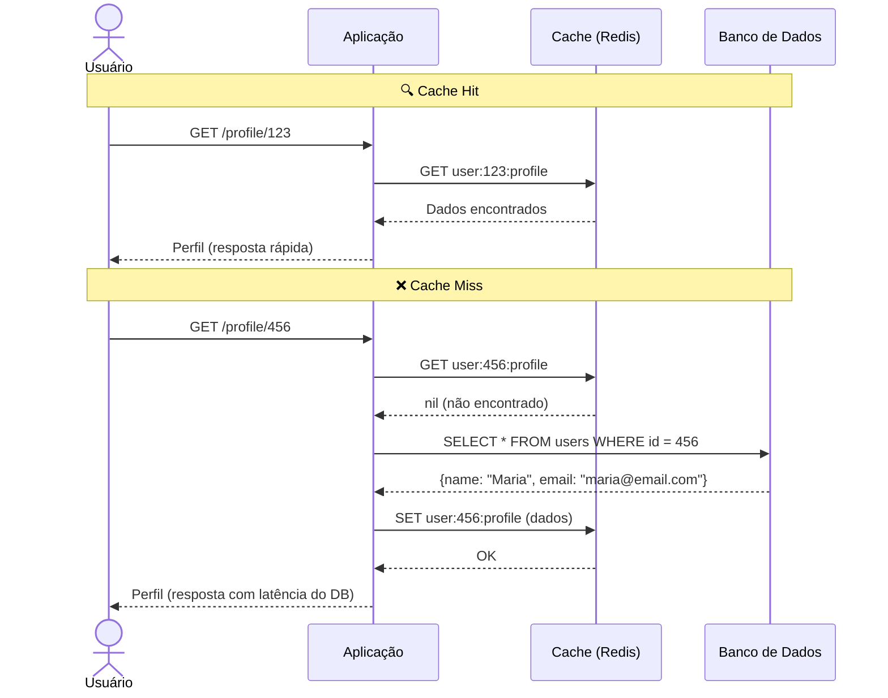
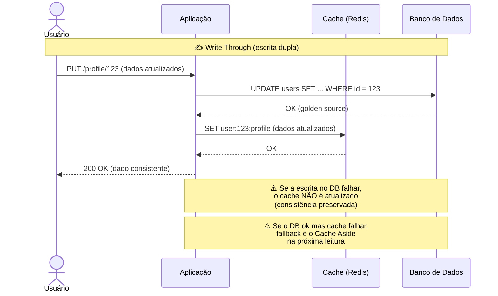
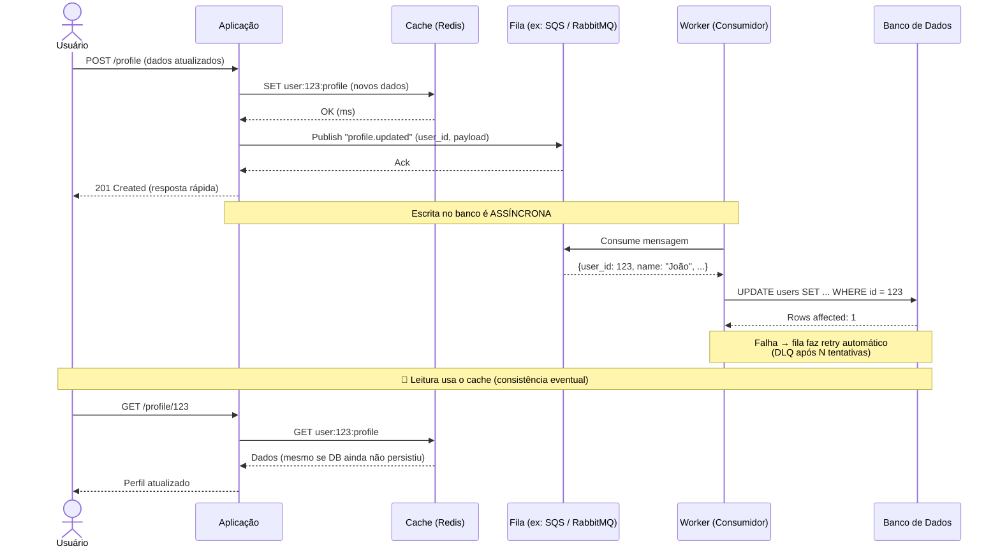
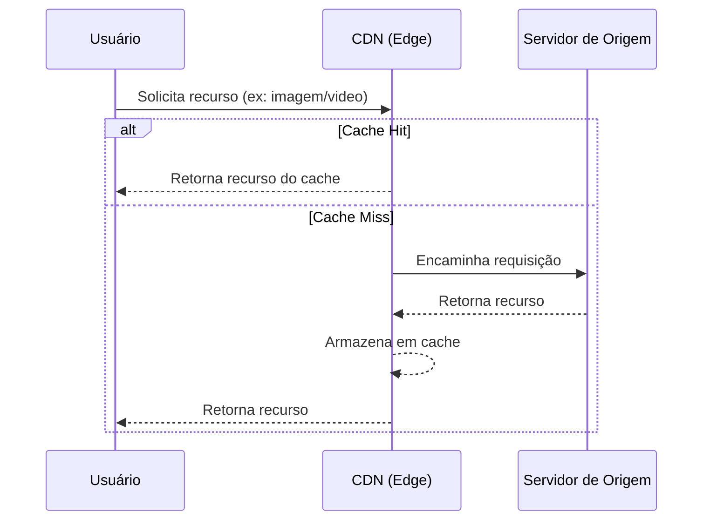

# Estratégias de Caching

## Cache

É uma camada intermediária entre o dado real e um dado temporário. Serve para armazenar o dado numa camada temporária, de dados que mudam pouco.

Importante para reduzir latência, diminuir a carga da fonte original, pode ser também uma camada de resiliência para quando a fonte real do dado estiver down.

O cache ele PRECISA ser reconstruído. Se não pudermos reconstruir um cache, ou seja, buscar na fonte real, não é uma boa estratégia de caching.

### Consistência de Dado em Cache

Tem consistência fraca, eventual, é uma camada extra entre a fonte real do dado.

Dado a fraca consistência do dado, precisamos ter estratégias de invalidação do cache e atualizá-lo.

### Time To Live (TTL)

É fortemente ligado ao padrão BASE. Sendo soft state.

Isso indica que eu consigo definir um momento para o item do cache ser enválido, sozinho. Isso é a capacidade do banco de dados em memória se mudar sozinha.

---

## Políticas de Evicção

As políticas de evicção representam políticas para expurgo de dados quando o cache está com a memória cheia.

Como o cache ele é baseado em memória, vamos imaginar um cache Redis que tenha 4GB de memória. Quando essa memória encher e o cache precisar salvar mais um item, é necessário uma política de expurgo.

### LRU - Least Recently Use

Política de remoção do item menos usado recentemente. Ele é baseado em timestamp do último acesso.

O dado que será apagado, será sempre correlacionado a última vez que ele foi acessado. A cada novo acesso, o timestamp se renova.

Exemplo: quando foi a última vez que esse item foi acessado?

Necessário o banco de dados armazenar o timestamp de cada acesso.

### LFU - Least Frequentily Use

Política de remoção baseada em frequência de acesso do dado. Diferente do LRU, esta política usa a frequência de acesso ao dado para deleção.

Imagine um dado foi inserido há 30 dias, mas é acessado com bastante frequência, contra um dado que foi inserido há 3 dias, mas é acessado com pouca frequência, a política irá expurgar o dado de 3 dias, embora ele seja mais "novo" do que o dado de 30 dias atrás.

Exemplo: quantas vezes esse item foi acesso no total?

Necessário o banco de dados armazenar o contador de acesso.

### FIFO - First In First Out

Política de remoção de dado que implica que o primeiro dado a entrar, será o primeiro dado a sair, independete do último acesso ou da sua frequência de acesso.

Necessário armazenar o timestamp de cada item inserido

### RR - Randonly Remove

Política de remoção aleatória. Pode implicar em remover dados acessados recenemtente ou dados frequentes. No entanto, tem um custo computacional mais barato, por que não precisa ficar controlando a frequência ou quantidade de vezes que o dado é acessado.

### Invalidação de Cache

É uma estratégia para invalidar o cache e enviar que a política de evicção entre em ação constantemente.

Uma invalidação de cache pode ser por TTL, por lógica no algoritmo, ou manual.

O ideal é nunca chegar numa política de evicção, pois tente a perder bastante em termos de recursos computacionais.

---

## Cache Hit, Cache Miss e Hit Rate

Cache Hit, Cache Miss e Hit Rate são métricas que me ajudam a entender se minha estratégia de caching está sendo bem efetiva.

O Cache Hit, indica quantas vezes o dado foi encontrado em cache.

O Cache Miss, indica quantas vezes o dado NÃO foi encontrado em cache.

O Hit Rate é a métrica final que calcula qual o percentual meu cache está sendo efetivo. A conta para chegar no Hit Rate é Cache Hit / Total de Requisições no Cache.

Então se colocarmos na ponta do lápis seria:

Cache Hit: 8
Cache Miss: 2
Total de Requisições no Cache: 10

Hit Rate = 8 / 10 = 0,8 x 100 = 80%

---

## Implementações de Cache

### Cache em Memória

Indica o cache em memória da própria aplicação, sem usar uma tecnologia externa como o Redis, por exemplo.

É altamente performática, por usar a memória da própria app, geralmente usado em estruturas de hashmap (chave e valor), tem um escopo limitado por thread / processo e requer invalidação manual para evitar que a memória da aplicação lote.

Exemplo:
- Réplica A da aplicação escreve Gustavo em cache a Réplica B não enxerga Gustavo
- Réplica B da aplicação escreve Luiza em cache a Réplica A não enxerga Luiza

### Cache Em Sistemas Distribuídos

Um cache em sistema distribuído serve para que várias réplicas da minha aplicação consigam acessar o mesmo dado salvo num cluster de cache.

Tecnologias que viabilizam isso são por exemplo o Redis, Memcached, etc.

Diferente do cache em memória, que é single process / thread, o Cache em Sistemas Distribuídos, faz com que todas as chaves sejam acessíveis por todas as réplicas da aplicação.

Exemplo:
- Réplica A da aplicação escreve Gustavo em cache. A Réplica B enxerga Gustavo
- Réplica B da aplicação escreve Luiza em cache. A Réplica A enxerga Luiza

---

## Cache em Camadas de Dados

Como os bancos de dados são hoje o maior gargálo em termos de escalabilidade e performance de aplicações, aplicar cache na camada de dados nos ajuda em melhorarmos a performance da nossa aplicação e escalar ela horizontalmente.

### Cache Aside

Também conhecida como Lazy Loading. É uma estratégia comum, em que o cache é criado sob demanda.

Exemplo: 

### Write Through (escrita dupla)

É uma estratégia que faz a escrita no banco de dados (golden source) e no cache ao mesmo tempo. Diferente do Cache Aside que escreve no cache somente quando o dado não é encontrado.

Ponto de atenção aqui é que o cache não tem abordagens transacionais, então podemos ter uma situação em que a escrita no banco falhe e no cache não, o que seria uma situação ruim.

Essa estratégia usa como fallback o Cache Aside. Imagine que a aplicação faz a escrita em cache e por algum motivo este cache não está mais lá, por N motivos. A aplicação que lê o cache, precisa fazer este fallback e construir o cache, consultando o dado na base.

É utilizado em cenários que a leitura de dado é muito intensa, o cache ajuda a reduzir o uso do banco de dados em termos de leitura.

### Write Behind (Lazy Writing)

É uma estratégia onde a escrita em cache é feita primeiro do que no banco de dados final, visando reduzir o uso de escrita em bancos de dados. Essa estratégia é utilizada para escrever no banco de forma assíncrona, então poderíamos ter a seguinte situação:

### Cache de Conteúdo Distribuído (CDN)

O CDN ele serve para servir de cache muitas vezes de peças de front-end. Então imagine uma aplicação que tem seu front-end construído, você não fica mudando toda hora os estilos, seu HTML ou até mesmo o seu java script, então faz muito sentido que este código seja replicado geograficamente e a solicitação a este conteúdo seja feito para servidores de cache mais próximos do usuário ao invés de buscar no servidor de origem.

Precisamos ter formas de invalidar este cache manualmente, para evitar que quando um novo deploy seja feito, a nova página web seja exibida ao usuário.

