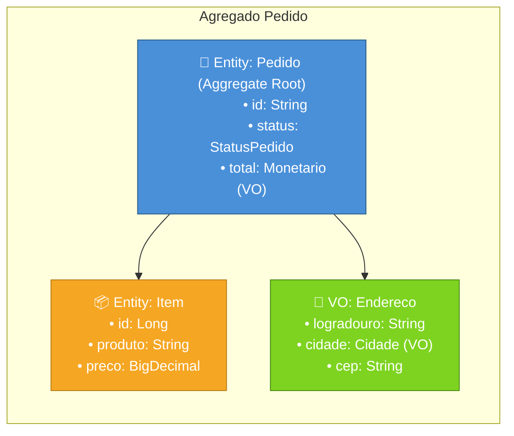
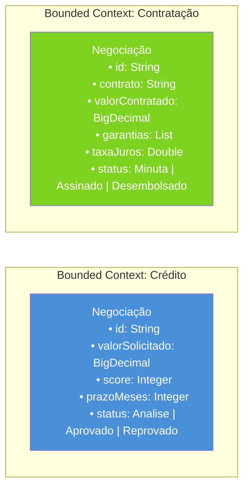

# Microsserviços, Monolitos e Domínios

## Monolitos

Uma arquitetura monolítica representa que todas as capacidades de um software estão em um único conjunto ou todos os domínios estão em um único conjunto. Por exemplo: capacidades de cadastro de cliente, pagamento, controle de estoque.

Uma arquitetura monílitica não representa algo ruim. Ela tem seus benefícios e malefícios conforme todas as outras arquiteturas.

As vantagens de se pensar em uma arquitetura monolítica são:
- Geralmente são sistemas que estão iniciando e mais simples
- Trabalha com menos dependências externas
- Não tem overhead de vários protocolos de comunicação
- Geralmente se trabalha com um único banco de dados
- Validações mais simples, sem dependências externas
- Facilidade de testes e integrações
- Deploy unificado, sem necessidade de orquestrar vários deploys de peças diferentes

As desvantagens de uma arquitetura monolítica são:
- Conforme o software cresce, validações se tornam complexas
- Muitas pessoas trabalhando num mesmo codebase e desafios de code merge, code reviews, atenções e guard rails para evitar códigos ruins em produção
- Um único banco de dados pode trazer uma performance ruim para a aplicação
- Desafios em escalabilidade. Você precisa escalar todo sistema, enquanto só uma pequena parte dele precisa ser escalada
- Torna-se um único ponto de falha (se o cadastro de cliente degrada o sistema, ele se degrada como um todo)

---

## Microsserviços

É um estilo arquitetural onde o software é dividido em pequenas partes, geralmente distribuídas em domínios, de forma indivisível. Por exemplo, se tenho a capacidade de cadastro de cliente, essa capacidade é representada por um microsserviço dentro da minha arqutetura. Todo o ciclo de vida do microsserviço é independente, ou seja, do desenvolvimento ao deploy, ele é independente.

A comunicação entre vários microsserviços de se da por meio de protocolos de rede (HTTP, gRPC ou mensagerias).

As vantagens de uma arquitetura de microsserviços:
- Descentralização, podendo cada microsserviço ser desenvolvimento sozinho, em linguagens e framworks diferentes
- Resposanbilidade reduzida
- Escalabilidade independente. Caso eu queria escalar somente o microsserviço de cliente, eu consigo
- Os times conseguem trabalhar em microsserviços independentes, diminuindo acoplamento dos times em um mesmo code base


As desvantagens de uma arquitetura de microsserviços:
- Adiciona uma complexidade operacional muito maior
- Orquerstrar vários microsserviços é muito mais complexo do que um único monolito
- Controlar deploys, versionamento de APIs, coordenação do software como um todo
- Comunicação por rede terão problemas (latência, necessidade de resiliências, circuit brakers, retires, DLQs)
- Testes mais complexdos (distribuídos, integrados)
- Mocks podem nos dar falsos positivos
- Monitoração distribuída é mais complexa
- Correlação de logs

---

## Domain Driven Design

O Domain Driven Design ou DDD, visa aproximar ao máximo a escrita de software ao negócio que aquele software se propõe a resolver problemas. É uma metodologia que vai trabalhar linguagens de negócio e aproximar ao máximo na escrita do software.

Ajuda a separar de forma mais clara os domínios (cliente, pagamento, loja). Identifica limites entre domínios e funcionalidades de domínios diferentes.

DDD não é exclusivo de microsserviços. Ele pode ser aplicado em code bases de monolítos.

Uma entidade anêmia é uma entidade de domínio que não faz nada. É algo que devemos evitar.

### Conceitos DDD

#### Domains

Representa o domínio de um determinado negócio. É o modelo base para construção do modelo do software, com regras de negócio, conceitos e processos que representam o negócio.

Exemplo: banco tem domínios como Crédito, Contas, Pagamentos, Empréstimos, Pix, Investimentos

---

#### Core-Domains

Representa a parte mais importante e central dos domínios do negócio. É o core da empresa.

Exemplos: 
- Bancos -> Pagamentos
- Uber -> Match de motoristas e passageiro
- iFood -> Math de cliente e restaurantes

---

#### Linguagem Ubiqua

Representa a linguagem comum entre negócio e tecnologia. Vem para evitar mal entendimento entre as partes, quando negócio pede A e tecnologia entende B.

A turma de engenharia de software precisa apoiar a traduzir a linguagem de especialistas do negócio para o software, evitando o que chamamos de shadow language (criar uma linguagem que só os engenheiros de software entendem e que difere dos especialistas de negócio).

Importante para:
- Documentação
- Código
- Diagramas e ADRs

---

#### Entities

Objetos de domínio que possui uma identificação única. Essa entidade é um id, um identificador. Ele pode ter outros atributos, mas precisa ser identificado de forma única e rastreável.

Exemplos: Cliente, Pedido, Conta bancária

```java
public class Pedido {
    private final String id;
    private StatusPedido status;
    private List<Item> itens;
    private BigDecimal total;

    public Pedido(String id) {
        this.id = id;
        this.itens = new ArrayList<>();
        this.total = BigDecimal.ZERO;
        this.status = StatusPedido.PENDENTE;
    }

    public void adicionarItem(Item item) {
        itens.add(item);
        total = total.add(item.getPreco());
    }

    public void confirmar() {
        if (itens.isEmpty())
            throw new IllegalStateException("Pedido sem itens");
        this.status = StatusPedido.CONFIRMADO;
    }

    public String getId() { return id; }
    public StatusPedido getStatus() { return status; }
}
```

---

#### Entidade Anêmicas

São entidades que não fazem nada. São classes que possuem atributos e um identificador, mas as ações não são representadas por elas.

**Exemplo ruim (anêmica — sem comportamento):**

```java
public class Pedido {
    private String id;
    private String status;
    private List<Item> itens;
    private BigDecimal total;

    public String getId() { return id; }
    public void setId(String id) { this.id = id; }

    public String getStatus() { return status; }
    public void setStatus(String status) { this.status = status; }

    public List<Item> getItens() { return itens; }
    public void setItens(List<Item> itens) { this.itens = itens; }

    public BigDecimal getTotal() { return total; }
    public void setTotal(BigDecimal total) { this.total = total; }
}
```

A lógica fica espalhada em serviços ou controllers, violando encapsulamento.

**Exemplo bom (com comportamento):**

```java
public class Pedido {
    private final String id;
    private StatusPedido status;
    private List<Item> itens;
    private BigDecimal total;

    public Pedido(String id) {
        this.id = id;
        this.itens = new ArrayList<>();
        this.total = BigDecimal.ZERO;
        this.status = StatusPedido.PENDENTE;
    }

    public void adicionarItem(Item item) {
        itens.add(item);
        total = total.add(item.getPreco());
    }

    public void confirmar() {
        if (itens.isEmpty())
            throw new IllegalStateException("Pedido sem itens");
        this.status = StatusPedido.CONFIRMADO;
    }

    public String getId() { return id; }
    public StatusPedido getStatus() { return status; }
}
```

A entidade protege suas regras de negócio e garante consistência interna.

---

#### Value Objects

Objeto de valor são definidos pelos atributos e não possuem identificadores únicos. São objetos intercambiáveis entre entidades, que se caso forem alterados, são novos objetos de valor.

Por exemplo: Endereço é um objeto de valor, que pode ser intercambiável entre várias entidades. Pense no objeto de valor Cidade. A Cidade tem um nome que é São Paulo. Várias Entidades (Pessoas) podem compartilhar a Cidade São Paulo.

```java
public final class Cidade {
    private final String nome;
    private final String uf;

    public Cidade(String nome, String uf) {
        if (nome == null || nome.isBlank())
            throw new IllegalArgumentException("Nome da cidade é obrigatório");
        if (uf == null || uf.length() != 2)
            throw new IllegalArgumentException("UF deve ter 2 caracteres");
        this.nome = nome;
        this.uf = uf.toUpperCase();
    }

    public String getNome() { return nome; }
    public String getUf() { return uf; }

    @Override
    public boolean equals(Object o) {
        if (!(o instanceof Cidade other)) return false;
        return nome.equals(other.nome) && uf.equals(other.uf);
    }

    @Override
    public int hashCode() {
        return Objects.hash(nome, uf);
    }
}
```

Características de Value Objects: **imutabilidade**, **sem identidade própria**, **igualdade por atributos** (`equals`/`hashCode`).

---

#### Aggregates / Agregados

Agregados representam um conjunto de Entidades e Objetos de Valor, que produzem fim a fim de uma determinada funcionalidade. Se eu tenho a funcionalidade de Pedido, nós podemos ter os Agregados, por exemplo:



A **raiz do agregado** (`Pedido`) é a única entidade exposta para fora — Itens e Endereço só são acessados através dela. Isso garante consistência transacional dentro do agregado.

---

#### Bounded Context / Contexto Delimitados

Contexto delimitado é uma fronteira entre domínios. Ajuda a delimitar quando um domínio termina e outro começa, evita que mesmos termos tenham significados diferentes para o mesmo domínio.

A linguagem ubíqua pode ter significados diferentes para domínios diferentes, então uma Negociação num domínio de Crédito pode ser uma coisa, enquanto uma Negociação para o domínio de Contratação pode ser outra coisa.

Bounded Contexto é muito utilizado na segregação de microsserviços, geralmente os microsserviços são quebrados em domínios diferentes.



O mesmo termo "Negociação" tem atributos, regras e fluxos completamente diferentes em cada Bounded Context — cada um define seu próprio modelo sem ambiguidade.

---

#### Services

Uma service representa serviços de negócio que são exceções de ações de Entidades. Imagine a entidade ContaBancaria. Uma ContaBancaria pode ter `efetuarDebito()` e `efetuarCredito()`, no entanto, uma **Service** poderia fazer a `transferenciaBancaria(ContaBancaria origem, ContaBancaria destino)`, por que numa transferência para a conta origem é um débito e para a destino é um crédito.

Outro exemplo que podemos usar é o de **calculo de taxa de juros**. Pense em duas entidades `Financiamento`e `Investimento`, ambas podem precisar de juros calculados, mas com propósitos diferentes. Daí então podemos ter a **service** `CalculadoraTaxaJurosService`, que tem o método `calcularTaxaJurosAnual()` que é compartilhada por essas duas entidades.

Uma service não mantém estado, ela apenas faz a ação.

```java
@Service
public class TransferenciaService {

    private final ContaRepository contaRepository;
    private final TransacaoRepository transacaoRepository;

    public TransferenciaService(ContaRepository contaRepository,
                                TransacaoRepository transacaoRepository) {
        this.contaRepository = contaRepository;
        this.transacaoRepository = transacaoRepository;
    }

    @Transactional
    public void transferir(String idOrigem, String idDestino, BigDecimal valor) {
        ContaBancaria origem = contaRepository.buscar(idOrigem);
        ContaBancaria destino = contaRepository.buscar(idDestino);

        origem.debitar(valor);
        destino.creditar(valor);

        transacaoRepository.salvar(new Transacao(origem, destino, valor));
    }
}
```

A service orquestra a operação que envolve múltiplas entidades — o débito e crédito continuam sendo responsabilidade da entidade `ContaBancaria`, mas o fluxo da transferência é coordenado pela service.
