# Princípios de Load Balancers e Proxies Reversos

## Load Balancers

Um load balancer ou balanceador de caraga, é uma peça central que resolve o problema de distribuir carga de trabalho entre múltiplos hosts. Antes de mais nada, ele é um pattern de rede e não um pattern de sistema.

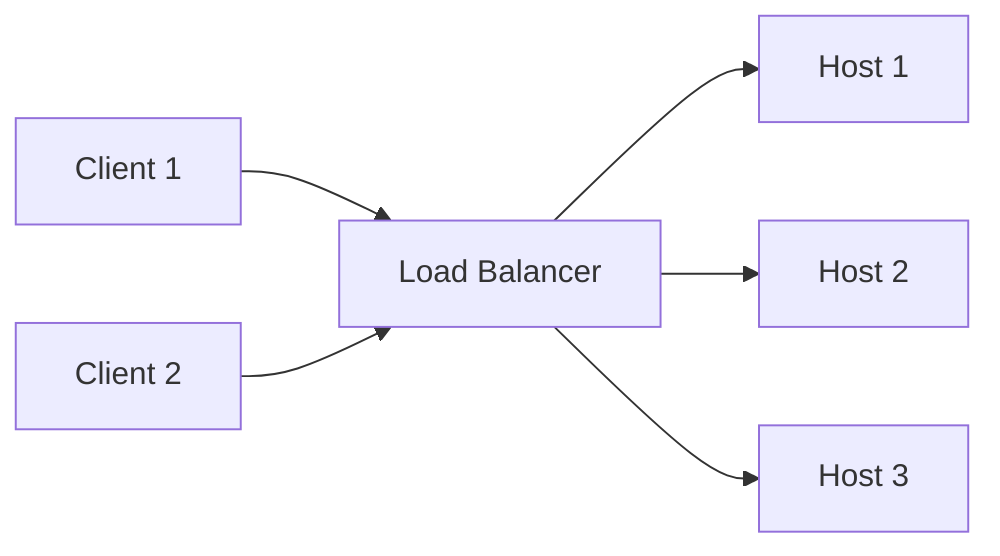

Trazendo um exemplo lúdico, imagine um supermercado com um único caixa. Se todas as pessoas precisarem passar por este mesmo caixa, alguns problemas podem acontecer:

- O caixa pode ser muito lento
- O caixa corre mais risco de cometer algum erro, devido a alta pressão
- Se o caixa precisar ir ao banheiro, toda a fila ficará esperando
- Se o caixa deixar de funcionar, o mercado pode parar de vender
- Este caixa passa a ser um único ponto de falha

Como resolvemos estes problemas? Adicionando mais caixas e as pessoas conseguem escolher qual fila entrar, com isso:

- Os atendimentos são mais rápidos
- Se um caixa houver algum problema, a fila de pessoas pode escolher outro caixa
- As filas serão mais rápidas
- Consigo ter filas prioritárias (caixa rápido, por exemplo)

### Escalabilidade Horizontal

A escalabilidade horizontal permite que novas instâncias da aplicação sejam criadas na medida em que a aplicação necessite. Dado alguns indicadores (% de uso de CPU ou memória), uma nova instância da aplicação é alocada, para conseguir atender o fluxo maior que eventualmente esteja chegando na aplicação.

Além disso, conforme o tráfego for sendo reduzido, essas instâncias também são removidas/reduzidas. Geralmente existe sempre um mínimo e máximo de instâncias configuradas, por exemplo, minha aplicação trabalha com no mínimo 3 instâncias (que aguenta o fluxo normal de solicitações) e vai escalar para no máximo 6 instâncias para trabalhar em momentos de pico. Isso diminui e aumenta com a escalabilidade horizontal, conforme os indicadores citados acima. 

### Warm Up

A estratégia de Warm Up dentro de pattern de load balancers implica em distribuir o tráfego para uma nova instância que esteja sendo criada de forma mais controlada, para ter um maior cuidado ao subir essa nova instância.

### Drain

A estratégia de Drain dentro de um patterna de load balancers implica em reduzir o tráfego de uma instância, a fim de que essa instância possa ser removida, quando o fluxo de carga começa a reduzir.

---

## Proxy Reverso

Um proxy reverso ele é um intermediador entre um único backend/aplicação. Ele é a camada que expõe a entrada para minha aplicação, podendo controlar:

- Rate limit
- Circuit Braker
- Health check e heart beat

Um load balancer e um proxy reverso são design patterns de arquitetura. Eles não são tecnologias e podem inclusive serem implementados com uma mesmo tecnoclogia. Por exemplo, um Nginx poder ser utilizado como um Load Balancer ou como um Proxy Reverso.

Eles não são excludentes, geralmente eles trabalham juntos, o Load Balancer recebe solicitações de um client e direciona a várias instâncias. Essas instâncias possuem na frente um proxy reverso, que direciona para o backend correto e responde ao client correto, podendo ter os controles citados acima.

### Visão Geral: Load Balancer + Proxy Reverso

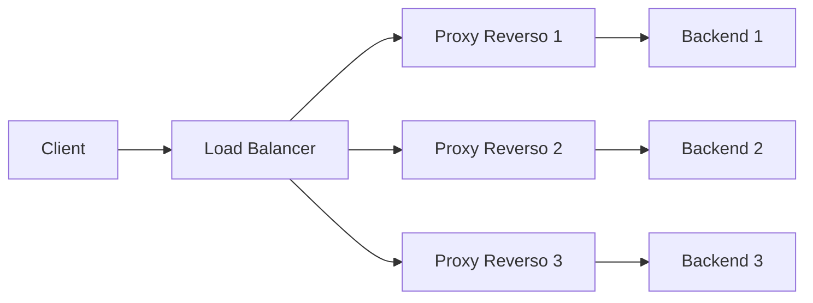

---

## Algoritmos de Balanceamento de Carga

Existem vários algoritmos e todos eles com seus trade-offs. Importante compreender como eles funcionam, para que você faça o redirecionamento correto da sua aplicação.

Alguns algoritmos:

- Round Robin: simples, justo, mas ingênuo
- Least Request: Quantidade de Requests
- Least Connection: Quantidade de Conexões
- LOR: inteligência baseada em carga
- IP Hash / Maglev: consistência e persistência de sessão
- Random: simplicidade máxima

### Round Robin

É um algoritmo mais comum e talvez mais utilizado. É um algoritmo baseado em escalonamento de CPU, observando os processos sendo executados na CPU por um determinado tempo (quantum). A distribuição de carga neste caso é feita de forma cíclica, evitando sobrecarga desproporcional e facilitando escalabilidade horizontal, dado que, a cada fim de ciclo, o algoritmo simplesmente direciona novas requisições para a próxima máquina.

**Limitações**

Distribuição de cargas iguais para os hosts sem levar em conta o nível de processamento. Por exemplo, ele direcionará uma mesma requisição de uma consulta de endereço e o processamento de um relatório mensal para o mesmo host, se solicitados dentro de um quantum no mesmo ciclo.

Outro ponto importante a se observar é com relação a spikes. Spikes são picos repetinos de solicitações, que, dado a característica do Round Robin, levarão este pico a acontecer somente em um host, podendo degradá-lo.

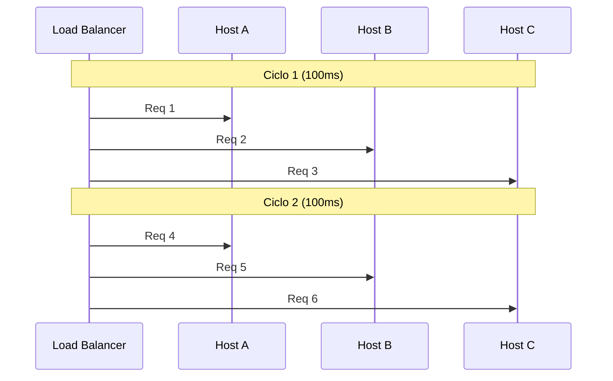

### Least Request

É uma abordagem que contabiliza o número de requisições de todos os hosts e sempre encaminha o próximo request a quem menos recebeu. O grande objetivo é garantir distribuição uniforme entre todos os hosts, baseado em volume e não em tempo, diferente do Round Robin.

Cenários onde este algoritmo é indicado é para onde temos um alto volume de requisições e elas são simples e curtas, com alto troughput. Exemplo: consulta de saldo bancário. Não tem nada muito complexo a se fazer nesta requisição. É basicamente dado um `id` eu tenho um saldo, com um cálculo simples.

**Limitações**

Possui basicamente as mesmas limitações do Round Robin, pois ele não leva em consideração o processamento da requisição para distribuir a carga, apenas a quantidade de requisições direcionadas a um host. Isso pode sobrecarregar determinado host. No entanto, ele deve ser inteligente o suficiente para diminuir as requisições de um host que esteja com alto volume.

Outro ponto importante é que, ao adicionar um novo host, se o algoritmo não tiver a inteligência de zerar o contador dos demais hosts, novos hosts sempre virão com o contador zerado, fazendo com quem toda nova requisição seja direcionada a este novo host, sobrecarregando-o.

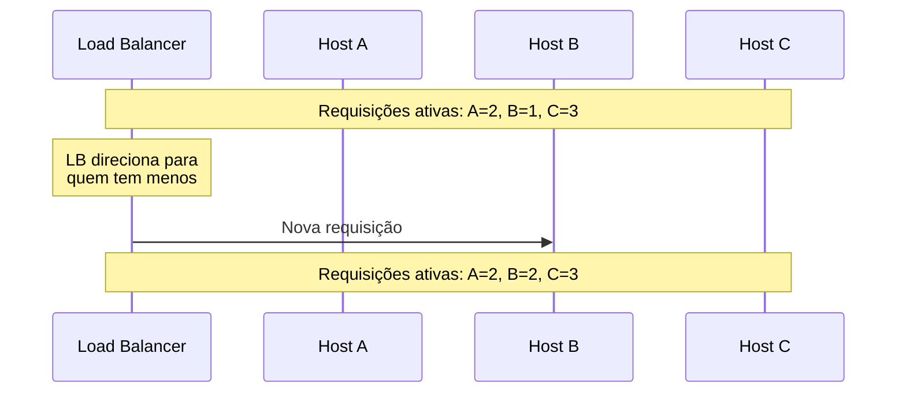

### Least Connection

Ao contrário dos dois últimos algortimos acima, este algortimo visa levar em consideração conexões ativas com os hosts, para distribuir a carga de forma mais inteligente. Ele vai direcionar a nova requisição para o host que tem menos conexões ativas no momento, ou seja, ele tem que fazer uma gestão das conexões.

Uma conexão ativa é algo que está em andamento entre cliente e servidor. Uma conexão ativa não significa que tem algo sendo processado no servidor, como por exemplo, web sockets.

**Limitações**

Se concentra em número de conexões ativas e não em carga, assim como os demais, podendo sobrecarregar o servidor/host que tenham uma alta carga de processamento.

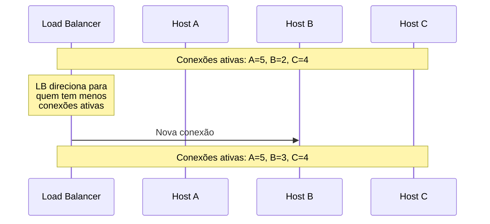

### Least Outstanding Requests (LOR)

É um algoritmo complexo e sofisticado. Ele leva em consideração a carga de processamento/saturação dos hosts. Foca em gerenciar conexões que estejam processando alguma coisa. Ele foca em requisições pendentes, ou seja, uma requisição que ainda não foi concluída. Ele entende que uma conexão ativa e que não está processando algo, pode ser algo idle e pode ser usado.

Entende latência ou CPU para direcionar requisições. Ele busca ponderar carga de trabalho de fato. Funciona em ambientes que tem diferenças entre as requisições (consultas simples e processamento de relatórios por exemplo)

**Limitações**

Por ser um algortio mais complexo, precisamos ter mais recursos computacionais, precisamos monitorar com mais cuidado, o balanceador de carga pode ser um ofensor.

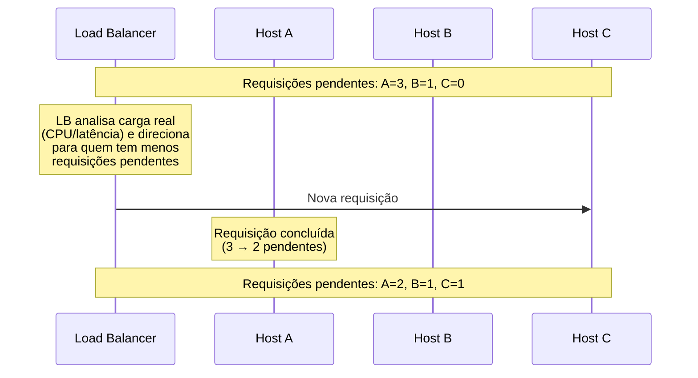

### IP Hash

Garante que o mesmo usuário, dado um criteŕio (o IP neste caso), seja direcionado sempre ao mesmo host (caso ele esteja disponível). Ele faz um hashing do IP e direciona sempre para o destino correto ou mesmo destino.

**Limitações**

É uma estratégia menos eficaz para usuários que esteja atrás de proxies ou NATs, dado que, um conjunto muito grande de usuários pode ser direcionado para um mesmo host, dado que o IP de saída destes usuários atrás de proxies ou NATs serão os mesmos, podendo gerar uma sobrecarga num host específico.

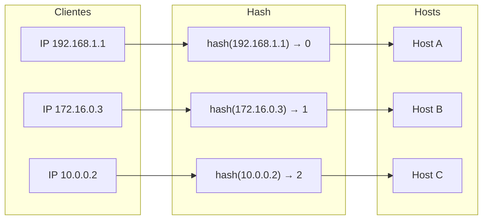

### Manglev

É um algoritmo desenvolvido pela Google, similiar ao IP Hash, no entanto, priorizando cache de dados. Por exemplo, ele é usado em cenários onde eu preciso direcionar a mesma requisição para um mesmo host, mas a ideia é que esse redirecionamento seja para onde existe um cache disponível, para que não tenhamos a necessidade de manter um cache distribuído.

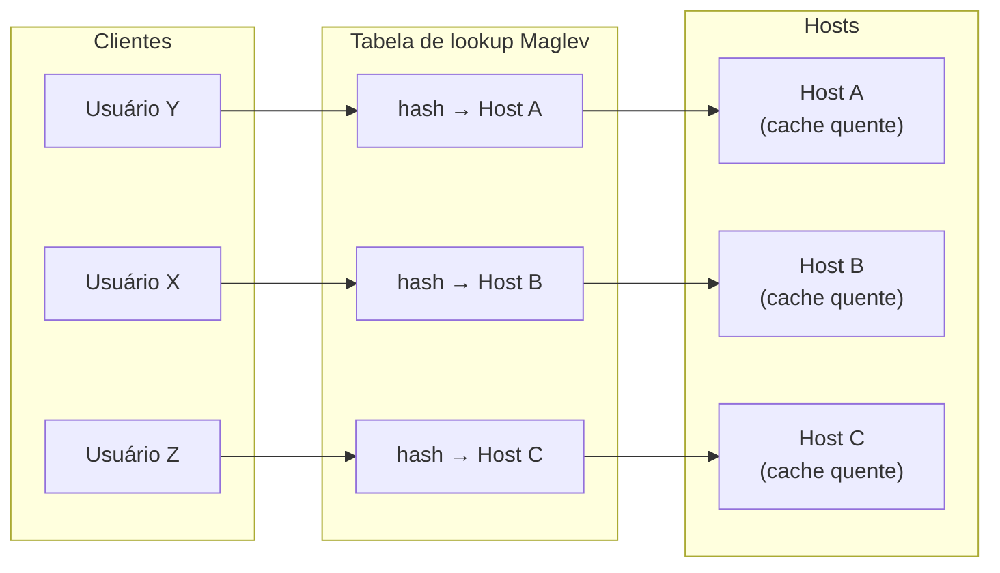

Mas diferente do IP Hash, se um host for removido, o Maglev redistribui apenas as entradas da tabela que apontavam para ele, mantendo as demais intactas — minimizando o impacto no cache.

### Random

É a implementação mais simples e rápida, ela vai randomizar o envio das requisições, sem olhar nenhuma métrica. É bom para cenários leves e uniformes, mas em contra partida, ele pode gerar carga desigual para alguns hosts.

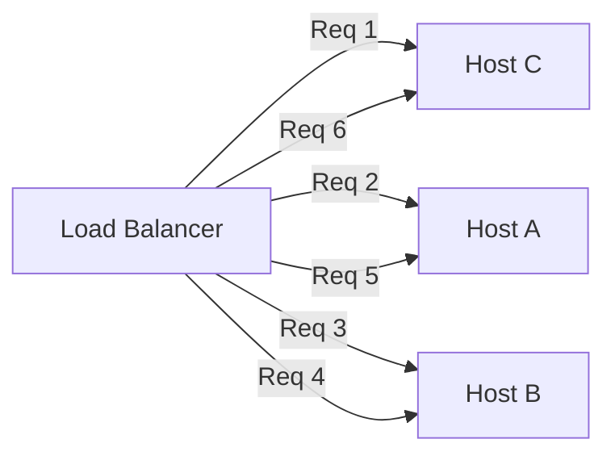

---

## Modelo OSI em Load Balancers (Layer 4 e 7)

### Load Balancers de Layer 4 (Transporte)

Trata-se do balanceamento de carga de pacotes TCP e UDP. Não tem capacidade de interpretação de payloads, headers e URLs. Lida só com endereçamento IP e portas. Não tem implementações de algortimos complexos e por isso são extremamente eficientes e rápidos, otimizando latência tráfego, já que não tem necessidade de implementação de protocolos complexos para interpretar o conteúdo da requisição.

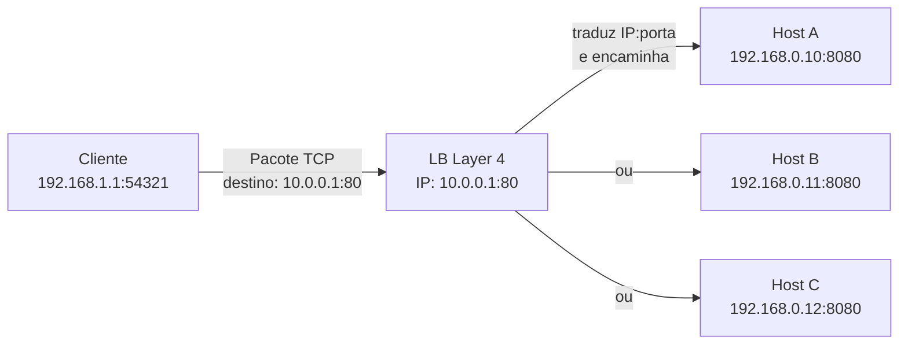

O principal trade-off é a falta de customização de roteamento. Ele não vai conseguir fazer distribuição com base em nada que dependa de payload, header ou URLs

### Load Balancers de Layer 7 (Aplicação)

Opera diretamente na camada de aplicação. Trabalha com protocolos complexos, mais próximos do usuário (HTTP, gRPC, WebSocket). Ele consegue ler o conteúdo da requisição (payload, headers, URLs, query string) e rotear as conexões baseada nessas informações. Tem mais flexibilidade que o L4, dado que consegue ler conteúdo. Inclusive, pode trabalhar com caching.

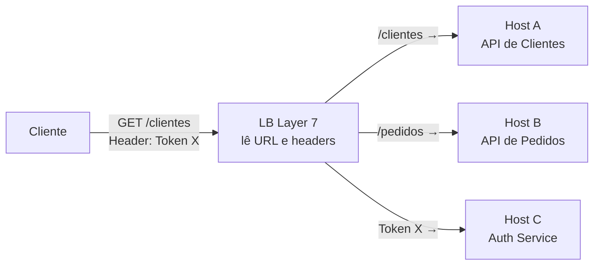

É ideal para APIs e microsserviços. Por exemplo, se tivermos uma regra `/clientes`, conseguimos dizer que esta rota vai ser direcionada para um host específicio.

Foca mais em dar inteligência no roteamento, enquanto o load balancer de layer 4 foca em ser mais rápido e eficiente. Ambos dão suporte aos algortimos citados acima.

---

## Tecnologias de mercado

### Envoy Proxy

- Cloud Native
- Proxy de Alta performance
- Orientado a escalabilidade
- Base de service mesh
- Base de INgress Controllers
- Suporte nativo a vários algoritmos
- Suporte a L4 e L7
- Load Balancer e Proxy Reverso
- Suporte a Controle Plano e Dataplane

### Nginx

- Leve, estável e com baixo consumo de recursos
- SSL/TLS offloading, cache e autenticação nativa
- Muito usado em produção pela simplicidade de configuraçẽos
- Suporte somente a L7 (aplicação)
- Servidor web, proxy reverso e load balancer em um único binário

### HAProxy

- Eficiência e confiabilidade
- Algoritmos avançados de balanceamento
- SSL/TLX offload
- Ambientes de larga escala
- Principal alternativa ao Nginx
- Suporta HTTP2, web socket
- Não é muito indicado a proxy reverso

### Traefik

- Configuraçaõ dinâmica, integrado a Docker e Kubernets
- Atualiza rotas automaticamente quando serviços sobem ou descem
- Trabalha em L4 e L7
- Simplicidade e velocidade
- Balanceador de carga
- Capacidade de alteração sem precisar reiniciar

### Ingress Controllers

- Kubernets
- Gerenciam acesso externo
- Oferecem roteamento HTTP/HTTPS e TCP avançado
- Simplificam acesso em ambientes multi-serviço
- SSL/TLS termination, regras de roteamento e observabilidade

### Cloud Load Balancers

- Serviços gerenciados da AWS, GCP e Azure
- Escalabilidade elástica e integração nativa com a cloud
- Suporte a L4 (TCP/UDP) e L7 (HTTP/HTTPS)
- Recursos avançados: roteamento, SSL offloading, health checks
- Provisionamento via API