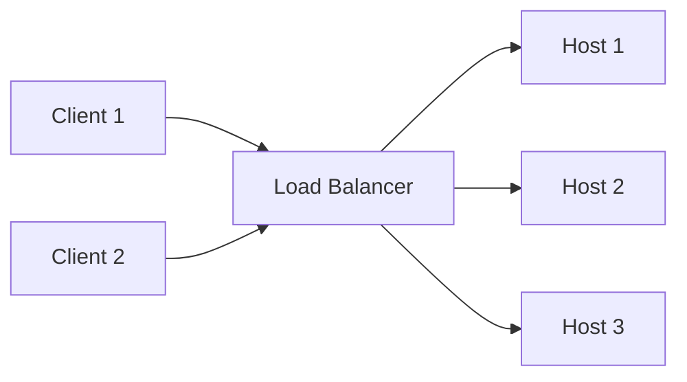
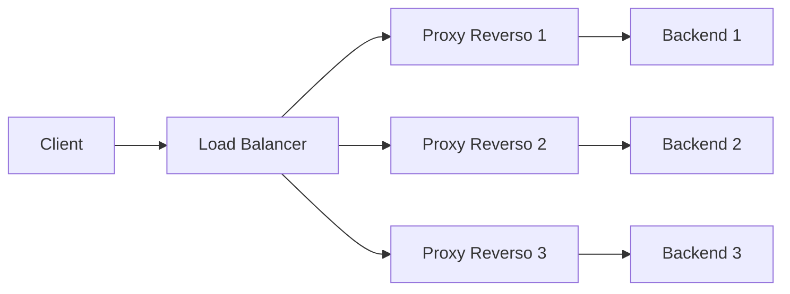

# Princípios de Load Balancers e Proxies Reversos

## Load Balancers

Um load balancer ou balanceador de caraga, é uma peça central que resolve o problema de distribuir carga de trabalho entre múltiplos hosts. Antes de mais nada, ele é um pattern de rede e não um pattern de sistema.

Trazendo um exemplo lúdico, imagine um supermercado com um único caixa. Se todas as pessoas precisarem passar por este mesmo caixa, alguns problemas podem acontecer:

- O caixa pode ser muito lento
- O caixa corre mais risco de cometer algum erro, devido a alta pressão
- Se o caixa precisar ir ao banheiro, toda a fila ficará esperando
- Se o caixa deixar de funcionar, o mercado pode parar de vender
- Este caixa passa a ser um único ponto de falha

Como resolvemos estes problemas? Adicionando mais caixas e as pessoas conseguem escolher qual fila entrar, com isso:

- Os atendimentos são mais rápidos
- Se um caixa houver algum problema, a fila de pessoas pode escolher outro caixa
- As filas serão mais rápidas
- Consigo ter filas prioritárias (caixa rápido, por exemplo)

### Escalabilidade Horizontal

A escalabilidade horizontal permite que novas instâncias da aplicação sejam criadas na medida em que a aplicação necessite. Dado alguns indicadores (% de uso de CPU ou memória), uma nova instância da aplicação é alocada, para conseguir atender o fluxo maior que eventualmente esteja chegando na aplicação.

Além disso, conforme o tráfego for sendo reduzido, essas instâncias também são removidas/reduzidas. Geralmente existe sempre um mínimo e máximo de instâncias configuradas, por exemplo, minha aplicação trabalha com no mínimo 3 instâncias (que aguenta o fluxo normal de solicitações) e vai escalar para no máximo 6 instâncias para trabalhar em momentos de pico. Isso diminui e aumenta com a escalabilidade horizontal, conforme os indicadores citados acima. 

### Warm Up

A estratégia de Warm Up dentro de pattern de load balancers implica em distribuir o tráfego para uma nova instância que esteja sendo criada de forma mais controlada, para ter um maior cuidado ao subir essa nova instância.

### Drain

A estratégia de Drain dentro de um patterna de load balancers implica em reduzir o tráfego de uma instância, a fim de que essa instância possa ser removida, quando o fluxo de carga começa a reduzir.

---

## Proxy Reverso

Um proxy reverso ele é um intermediador entre um único backend/aplicação. Ele é a camada que expõe a entrada para minha aplicação, podendo controlar:

- Rate limit
- Circuit Braker
- Health check e heart beat

Um load balancer e um proxy reverso são design patterns de arquitetura. Eles não são tecnologias e podem inclusive serem implementados com uma mesmo tecnoclogia. Por exemplo, um Nginx poder ser utilizado como um Load Balancer ou como um Proxy Reverso.

Eles não são excludentes, geralmente eles trabalham juntos, o Load Balancer recebe solicitações de um client e direciona a várias instâncias. Essas instâncias possuem na frente um proxy reverso, que direciona para o backend correto e responde ao client correto, podendo ter os controles citados acima.

### Visão Geral: Load Balancer + Proxy Reverso

