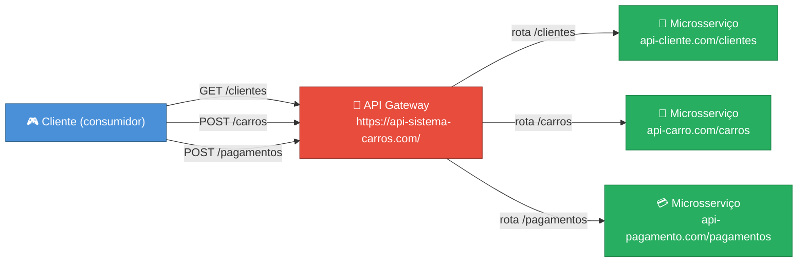
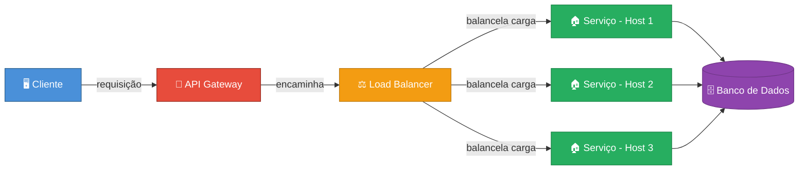
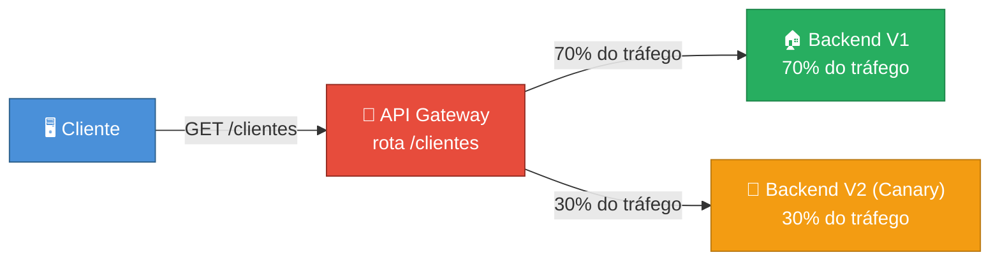

# API Gateways

## Introdução a API Gateways

API Gateway não é uma tecnologia específica. Ele é um pattern de exposição de sistemas. É uma camada de de abstração entre cliente e servidor, que disponibilizará um ponto único de contato entre diversos sistemas backends.

Ele é um pattern responsável por distribuição de APIs REST, no entanto, pode ou não seguir este padrão. Geralmente é orientado a domínios e ao receber chamadas pode enriquecê-las, fazer algumas tratativas, assim como na resposta.

Um API Gateway costuma resolver os seguintes problemas:
- Exposição de endpoints privados
- Diversidade de endpoitns de microsserviços
- Mapeamento de URLs granulares
- Controle de Auth e Rate Limiting
- Controle do ciclo de vida
- Cobrecarga operacional e documentação

---

## API Gateways em Monolitos e Microsserviços

### Monolitos

Pensando em monolitos, ele já se propõe a expor seus recursos através de uma URL única, por exemplo: `https://minhaapi.com/cliente`, `https://minhaapi.com/endereco`, `https://minhaapi.com/pagamento`.

Quando a gente coloca um API Gateway na frente desta aplicação monolitica, nós começamos a ganhar algumas capacidades, como:
- rate limiting
- autenticação
- trottling
- exposição excessiva (eu exponho somente as rotas que eu quero, ou seja, usando os exemplos acima, se eu quiser expor somente a rota `/cliente` eu conseguiria)

### Microsserviços

Agora quando estamos falando de microsserviços, vamos imaginar que temos um cliente consumidor do meu sistema distribuído. Meu sistema distribuído tem as capacidades de:

- Cadastro de cliente (https://api-cliente.com/clientes)
- Cadastro de carros (https://api-carro.com/carros)
- Pagamento do carro (https://api-pagamento.com/pagamentos)

Caso o consumidor queira consumir todos estes microsserviços, ele teria pelo menos 03 pontos de contato. Agora quando adicionamos o API Gateway na frente, ele passa a ter um único ponto de contato:

- Sistem de venda de carros (https://api-sistema-carros.com/)

E para ele acessar os serviços, o API Gateway consegue resolver este problema adicionando o filtro por paths, por exemplo:

- Listagem de todos os clientes GET cliente `/clientes`
- Cadastro de um cliente POST cliente `/clientes`
- Edição de um cliente PUT cliente `/clientes`

### Exemplo Prático: Cliente -> API Gateway -> Rotas -> Microsserviços

Usando o sistema de venda de carros, o consumidor faz uma única chamada ao gateway, que roteia para o microsserviço correto baseado no **path**:

---

## API Gateways vs Load Balancers

Esses dois patterns não são excludentes. Eles podem e devem trabalhar juntos em uma arquitetura de sistemas. Enquanto o API Gateway se propõe a receber e rotear requisições HTTP REST para vários serviços a partir de um único ponto de contato, o Load Balancer ele se propõe a balancear a carga recebida para um determinado host.

---

## Roteamento Granular, Autenticação e Autorização

### Roteamento Inteligente e Granular

O roteamento inteligente e granular permite que clientes conversem com o API Gateway de forma centralizada, ou seja, com um único ponto de contato e o gateway consiga e saiba para qual serviço aquela solicitação atenderá. Isso pode ser feito de diversas maneiras, através de verbos HTTP, paths, headers, etc.

Além disso, permite que a gente faça a troca de de backends de forma transparente ao consumidor, desde que sejam respeitados os contratos entre cliente e servidor, ou seja, o cliente conhece a rota `https://minha-api.com.br/clientes`, mas não sabe exatamente qual é o backend desta rota, ora ela pode ser `http://minha-aplicacao-v1.com.br/cliente/cadastrar`, e se necessário eu posso trocar para `http://minha-aplicacao-v2.com.br/cliente`, enquanto o consumidor enxerga somente `https ://minha-api.com.br/clientes`.

### Autenticação e Autorização

API Gateways também nos permite trabalhar com uma camada de segurança, validando quem é o cliente e se ele pode ou não acessar determinadas rotas. A Autenticação falará **quem é o cliente solicitante** e a Autorização falará **o que o cliente solicitante pode acessar**. Geralmente essa implementação funciona em conjunto com um Authorization Server, onde o cliente a partir de suas credenciais solicita um token de acesso (JWT por exemplo) e a partir do token de acesso, o gateway consegue fazer o check no Authorization Server.

---

## Rate Limiting e Trhottling

### Rate Limiting

Rate limiting é uma ação preventiva que podemos fazer em um API Gateway. É uma forma de limitarmos o quanto de requisições o API Gateway receberá e permitirá o tráfego no backend. Isso pode ser configurado de algums maneiras:

- Global: o API Gateway suporta 1000 TPS a nível global, ou seja, todos os clientes em conjunto poderão acumular 1000 TPS
- Cliente: o API Gateway suporta 10 TPS para o Cliente A, 20 TPS para o Cliente B 

### Trhottling

O trhottling é uma ação reativa, usada para diminuir a saturação do meu backend. Se por algum motivo o API Gateway receber mais requisições do que ele deveria e minha aplicação está saturada, a ideia é que a gente acione o trhottling, limitando de forma reativa, o quanto as requisições serão encaminhadas ao backend, como se fossem válvulas de escape.

### Token Bucket

Token bucket é um algoritmo que viabiliza o Rate Limiting. É uma forma de conseguir controlar quantas requisições poderão ser encaminhadas ao backend. As requisições são controladas por token ciclicos, então se um determinado cliente tem 100 tokens por ciclo e ele consome 50 tokens em um ciclo, no próximo, ele terá 150 tokens. Isso é permitido para que consigamos controlar eventuais picos, se em um terminado momento este cliente precisar consumir seus 150 tokens, por que recebeu um pico de requisições, será possível. O bucket tem um limite máximo e quando ele chega ao fim, os tokens excedentes são descartados, viabilizando a trava do rate limiting.

### Leak Bucket

O leak bucket funciona de forma diferente, ele é como se fosse um balde furado, onde a cada ciclo os tokens excedentes são descartados, permitindo que os clientes / consumidores tenham tokens fixos. Usando o exemplo de 100 tokens, imagine que o cliente / consumidor tenha 100 tokens disponíveis e consuma 50 em um primeiro ciclo. No próximo, ele continuará tenho 100 tokens e não 150.

Para todas essas estratégias, é comum que ao exceder deteminado limite (seja de rate limiting ou trhottling) os consumidores recebam um 429 Too Many Requests.

---

## Gestão e Versionamento

Com um API Gateway conseguimos trabalhar versionamento de API's. Então caso eu evolua minha aplicação e gere uma versão dois dela, eu consigo expor uma nova rota em um API Gateway, manter a convivência entre duas versões, até que eu consiga deprecisar a versão anterior. Gerlamente  funciona da seguinte forma:

- `https://minha-api.com.br/v1/cliente` -> `http://meu-backend.com.br/cadastrar-cliente`
- `https://minha-api.com.br/v2/cliente` -> `http://meu-backend.com.br/cliente`

Imagine que no exemplo acima eu tenha uma quebra de contrato forte, onde na v2 eu deixo de responder atributos ao cliente. Dessa forma, permitimos a troca gradual e mais suave entre as rotas.

Outro mecanismo permitido em um API Gateway é o Canary deployment. Isso permite que eu envie percentuais diferentes para backends diferentes para testar o comportamento de determinada versão da aplicação. Poderíamos ter o seguinte cenário:

