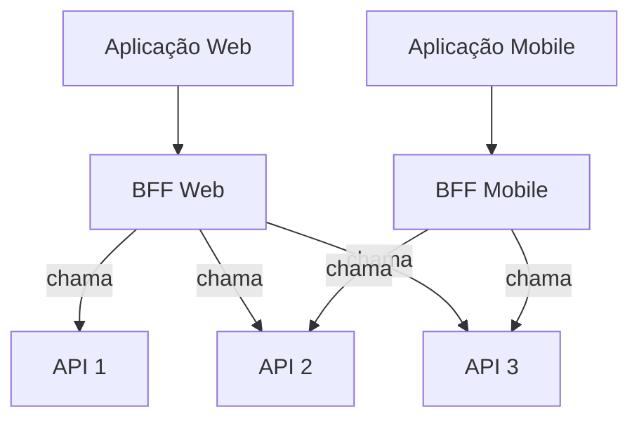
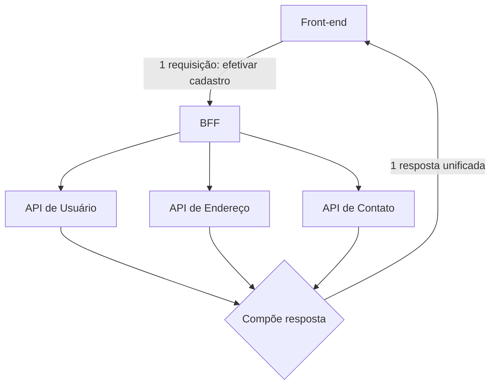
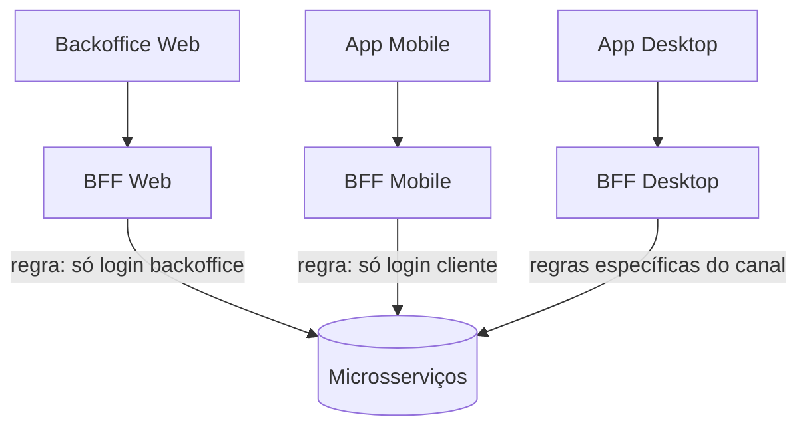
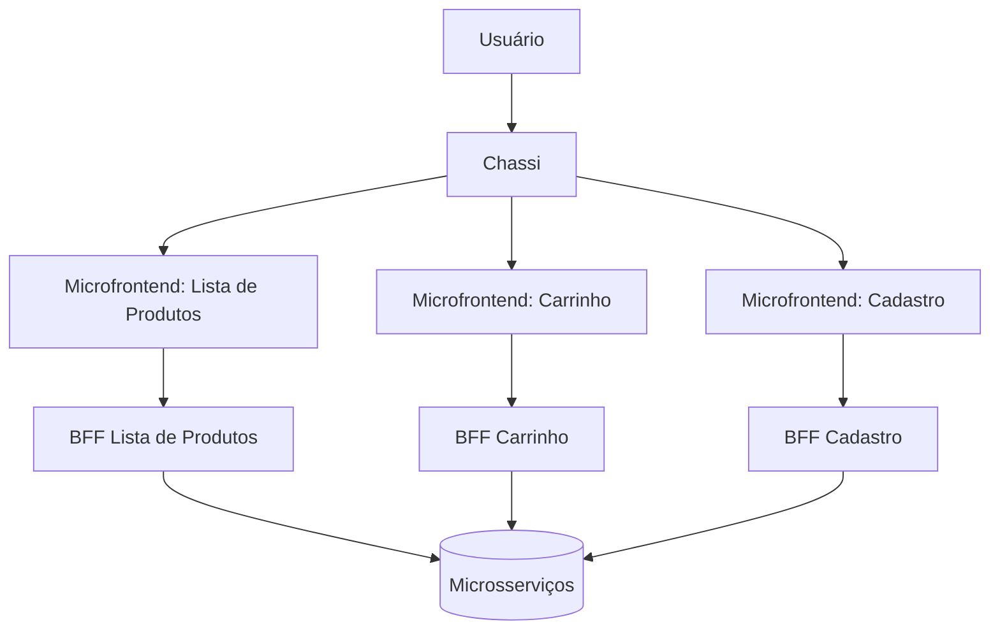
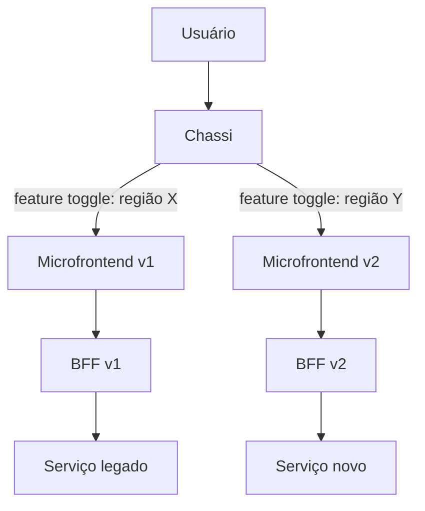

# BFF (Backend for Frontend)

## BFF Pattern

O BFF é um pattern arquitetural que propõe simplificar as integrações feitas por front-ends para endpoints de APIs. Este pattern diz que para cada canal, existirá um backend específico, que tratará abstrações necessárias por cada canal.

Então imagine que você tenha uma aplicação composta por 05 API's e 02 aplicações, uma web e outra mobile, mas que o backend é o mesmo.

Vamos supor que, na aplicação mobile, você não exponha a feature de alterações de cadastro do usuário, mas na aplicação web sim.

Tradicionalmente, se você estiver fora de uma arquitetura de BFFs, você teria que tratar essa regra no front. O BFF vem justamente para atuar nestes pontos. Aplicando o pattern de BFF, no seu BFF do mobile, você isolaria a regra de não permitir alteração de dados do usuário, já no BFF web, vocẽ permite.

Além do exemplo acima, podemos ter outros. Imagine que para efetivar o cadastro do usuário, você precise chamar 03 APIs. Fora do pattern do BFF, o front teria que intermediar a requisição pra 03 endpoints diferentes. Já numa arquitetura de BFF, o front chamaria o endpoint do BFF e o BFF cuidaria da integração com os outros endpoints.

Em resumo, o BFF é uma aplicação backend que simplifica regras de negócio e traz mais segurança para sua aplicação.

Enquanto o BFF Web expõe o endpoint de alteração de cadastro (chamando as 03 APIs), o BFF Mobile isola essa regra e não chama a API de alteração de cadastro.

---

## API Composition Pattern

Como dito no exemplo acima, o API Composition Pattern vem para resolver o problema do front-end ter que chamar várias APIs para fazer determinada ação.

A ideia central é que o front chame um endpoint do BFF e o BFF seja responsável por chamar todos os endpoints/APIs necessárias para que essa ação seja concluída e devolva a resposta ao front de forma unificada / composta, por isso o nome API Composition Pattern.

---

## Segregações de Canais de Comunicação

A segregação de canais representa literalmente a separação de BFF para cada canal da aplicação. Se eu tenho uma aplicação mobile, eu terei o BFF do mobile. Se eu tenho uma aplicação web, eu terei o BFF web. Se eu tenho a aplicação desktop, eu terei o BFF desktop.

Isso ajuda a segregas regras de backend específicas por canais e centralizá-las no backend. Por exemplo, pode ser que eu tenha um backoffice que lida com a aplicação web. O BFF do web não permite login de cliente, somente do backoffice. Já na aplicação mobile, o acesso é somente para o perfil de cliente, então o BFF se encarrega de tratar esse tipo de situação, embora os microsserviços sejam os mesmos por de trás dos panos.

Cada canal possui seu próprio BFF, que aplica as regras de negócio específicas daquele canal, embora todos consumam os mesmos microsserviços por trás.

---

## Microfrontends e BFFs

Uma arquitetura de microfrontend é um pattern arquitetura para front, onde nós separamos pedaços pequenos da jornada do usuário de forma desacoplada. Então imagine que em um sistema de um e-commerce, nós temos a página principal que exibe a lista de produtos, temos o carrinho de compras e a tela de cadastro do usuário. Cada uma dessas 03 jornadas são separadas, então teremos um microfrontend da lista de produtos, outro para o carrinho de compras e outro para tela de cadastro do usuário.

Cada um desses microfrontends eles são acoplados no que chamamos de chassi. Um frontend chassi é que agrupa todos os microfrontends e trazem a jornada completa ao usuário.

O BFF ele entra nessa história para compor o backend de cada um desses microfrontends, para que consigamos aplicar o que vimos nos exemplos acima.

Além dos benefícios já citados, em grandes empresas isso começa a facilitar situações segregadas de deploys. Ao invés de eu ter um único front ou um único BFF com tudo acoplado, eu consigo fazer deploy e se necessário rollback de cada uma das peças, sem afetar outras.

Cada microfrontend possui seu próprio BFF, permitindo composição isolada do backend e deploys/rollbacks segregados por peça, sem afetar os demais.

---

## Versionamentos e BFFs

Quando passamos a utilizar microfrontends e BFFs, isso nos traz um outro benefício que é o versionamento de cada uma dessas camadas. Como elas são totalmente desacopladas, isso me permite subir uma nova versão do microfrontend, com um novo BFF e eu posso inclusive testar essa nova versão de forma controlada.

Então imagine que eu tenho o microfrontend v1 e o BFF v1. O time de negócio solicita que façamos o teste de uma nova experiência de usuário. Com isso, construímos o microfrontend v2 e o BFF v2. Dentro da camada de chassi, eu consigo, a partir de uma feature toggle / flag, usar ambas as versões para determinados públicos, então eu poderia dizer que usuários que vem da região X, usam a v1 e usuários que vem da região Y, usam a v2.

O chassi decide, via feature toggle, qual versão do microfrontend (e do respectivo BFF) cada público consumirá, permitindo testar a nova experiência de forma controlada e com rollback imediato.

---

## Resiliência e Blast Radius

Embora a arquitetura de BFF nos traga certa resiliência no sistema, ela não é um pattern de resiliência. Portanto, precisamos ainda sim pensar na resiliência do nosso sistema como um todo.

Como nos exemplos acima, embora o BFF seja segregado por canal, nosso serviço downstream continua sendo o mesmo e caso a comunicação entre este serviço downstream falhe, a gente quebra a comunicação com todos os BFFs.

### Circuit Breaker

O Circuit Breaker existe para tratar a segurança de integração com serviços downstream. Por exemplo, imagine que um determinado serviço downstream está fora do ar e está retornando 50% de erro para o BFF. Para minimizar a carga no serviço downstream, nós vamos abrir o circuíto e parar de chamar o serviço downstream até que ele se recupere. Enquanto estivermos com o circuito aberto, é interessante que a gente matenha uma monitoração a fim de verificar quando o serviço downstream voltará a responder.

Junto de um circuit breaker a gente precisa sempre ter uma estratégia de fallback. Um fallback é o que meu sistema fará quando o circuito estiver ligado. Alguns exemplos:

- Quando o circuito estiver ligado, vou retornar a mensagem de erro "Sistema inoperante" e impedir que o usuário conclua sua compra
- Quando o circuito estiver ligado, vou enfileirar o pedido de pagamento, para processamento posterior e retornar uma mensagem ao usuário "Seu pagamento será processado em breve"

### Retries

Uma alternativa mais simples ao Circuit Breaker são os retries. Um retry nada mais é do que, quando um serviço downstream retornar eventualmente algum erro, eu tento obter a resposta novamente.

Um retry deve ser configurado com um máximo de retentativas, para que eu não degrade ainda mais o serviço downstream. Por exemplo:

- Tento comunicação (1x) -> serviço falha (HTTP status code 500)
- Tento comunicação (2x) -> serviço falha (HTTP status code 504)
- Tento comunicação (3x) -> serviço responde (HTTP status code 200)

Neste exemplo, cada requisição é feita num intervalo de 300ms

### Retries com exponencial backoff

Um backoff exponencial nada mais é do que eu fazer retentativas com espaço de tempo maior entre uma chamada e outra. No exemplo acima usamos 300ms de intervalo para cada chamada. No retry com exponencial backoff teríamos o seguinte:

- Tento comunicação (1x) -> serviço falha (HTTP status code 500) -> espero 200ms
- Tento comunicação (2x) -> serviço falha (HTTP status code 504) -> espero 400ms
- Tento comunicação (3x) -> serviço responde (HTTP status code 200) -> espero 800ms

Perceba que dobramos o tempo de espera para fazer novas requisições. Isso serve para jornadas de usuário que suportem um tempo de resposta maior, por que se observarmos no primeiro exemplo, meu tempo de resposta seria 900ms, já neste exemplo seria 1,4 segundo.

### Retries Jitter

Retry com Jitter é uma outra alternativa para espaçar a minha nova retentativa. Diferente do exponencial backoff que sempre utiliza o dobro do tempo anterior, o Jitter visa usar espaço de tempo para fazer uma nova requisição. Por exemplo, se minha chamada 1 falha, a próxima chamda será feita entre 2 a 4 segundos.

Isso ajuda principalmente em sistemas que lidam com muitas transações por segundo. Pense por exemplo numa situação que temos 1000 TPS. Se 1000 transações falham e eu estou usando backoff exponencial, o meu retry para o serviço downstream de 1000 transações serão enviadas juntas daqui 200ms, junto com as 1000 transações que estão acontecendo de forma normal no meu sistema, podendo fazer com que meu sistema downstream sofra mais ainda.

O algoritmo do Jitter vem para ajudar justamente nisso. Imagine o mesmo cenário acima, o Jitter vai espaçar 1000 transações num intervalo de 2 a 4 segundos, sendo que 200 transações podem ser feitas em 2,2 segundos, 300 transações podem ser feitas em 3,1 segundos, fazendo com que a carga ao serviço downstream seja mais espaçada.

### Cache

O uso de cache em BFF é extremamente valioso pensando em diminuir a carga para serviços downstream. Se pensarmos em serviços de cadastro de usuário, é um clássico exemplo que podemos utilizar. Ao usuário se logar na plataforma, podemos jogar os dados dele em cache, ao invés de ficar consultando toda vez para exibir o nome do usuário em tela.

### Fallback

O fallback ele é uma resposta secundária que meu BFF pode ter. Eu tento me comunicar com o serviço A e ele está degragado, então o meu fallback é me comunicar com o serviço B. Não necessariamente precisa ser um serviço, eu posso ter uma fila de fallback, posso ter cache de fallback, etc.

---

## Métricas e Experiência de Uso

O padrão de BFF também nos permite a segregas as métricas por cada um dos canais, dado que o BFF é uma aplicação web.

Um padrão bom para se começar a monitrar é o padrão RED (Rate Error Duration), onde:

- Rate: quantidade de requisições que a aplicação está recebendo por segundo ou minuto
- Error: percentual de erro que a aplicação está retornando
- Duration: duração que cada endpoint está tendo para processar uma requisição em média

